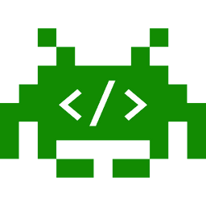

# Video Game Code Reference

### This Video Game Code Reference is a supplement to the [Video Game Project Guidebook](https://docs.idew.org/project-video-game/) and uses the [Phaser CE Javascript library](https://photonstorm.github.io/phaser-ce/) as the game engine.

## Copyright and License

Copyright © 2016-2021 Michael Frontz and Jim Lyst, Indiana University School of Informatics and Computing at IUPUI

This material is part of the [Computing by Design](https://docs.idew.org/the-cxd-framework/) high school computer science curriculum developed for the [Informatics Diversity-Enhanced Workforce \(iDEW\)](http://soic.iupui.edu/idew/) program, an award-winning community partnership in central Indiana that is broadening student participation in computing and helping students develop the skills essential for success in the 21st century workplace. The iDEW program is managed by the [Indiana University School of Informatics and Computing at IUPUI](https://soic.iupui.edu/).

This work is licensed under a [Creative Commons Attribution-NonCommercial-ShareAlike 4.0 International License](http://creativecommons.org/licenses/by-nc-sa/4.0/). You are free to use, share, or adapt this material for noncommercial purposes as long as you provide proper attribution and distribute any copies or adaptations under this same license.

