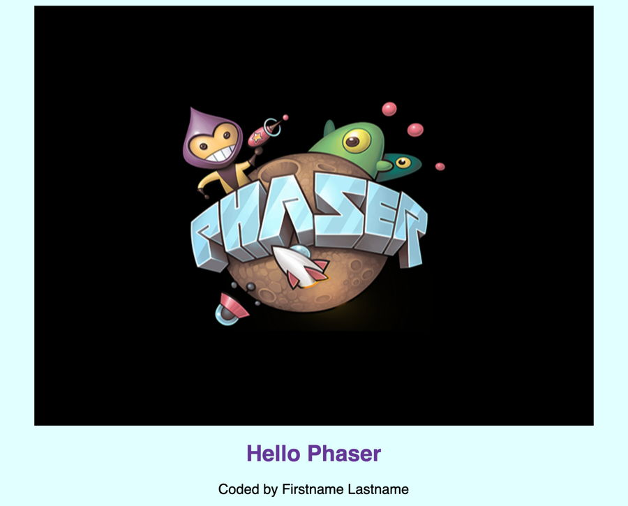

# A-5 Add Image to Game

Next, let's add an image to the game. We'll use the Phaser logo as the image.

## Add Image File to Assets Folder

[Download this image file](https://drive.google.com/open?id=13Q1uDSz5up02Gnk391I09S7-xRLgjxU8) named `phaser.png` to your computer.

Next, add \(or upload\) the image file into the `assets` folder in your code editor.

## Declare Variable for Image

In order to use this image in your game, you'll first need to declare a global variable in your JS game code to represent the image.

In a Phaser CE game, you'll have to declare variables for each image, sprite, sound effect, input control, etc. In addition, your game might need variables to track things like the player's score, the time remaining in the game, etc.

Copy this JS code, and paste it into your `script.js` file on line 5 \(which should be blank\):

```javascript
var logo;
```

This JS code statement declares \(creates\) a new variable named `logo`, which will be used to represent the Phaser logo image.

When coding in JavaScript, you get to decide your own names for your variables — but here are a few rules and recommendations to follow:

* **RULE:**  Each global variable needs to have a **unique** name.
* **RULE:**  Variable names **cannot** be a [reserved keyword in the coding language](https://www.w3schools.com/js/js_reserved.asp).
* **RULE:**  A variable name should start with a letter and **cannot** contain spaces. The name can include letters, digits, underscores, and dollar signs.
* **RULE:**  Variable names are **case-sensitive** \(e.g., `logo` and `LOGO` are different names\).
* **RECOMMENDATION:**  Use **camelCase** for variable names, which means use all lowercase letters, and only use an uppercase letter if you to start a new word in the name \(but don't include spaces between words\). For example:  `enemyShip`
* **RECOMMENDATION:** Variable names should be **clear and concise**, so they'll make sense to anyone reviewing your code.

## Load Image into Memory

The next step is to load the image into the game's memory, which is required before you can display the image.

To do this, you'll start using Phaser CE code in your JS file. Remember that your HTML loaded the Phaser CE game framework \(`phaser.min.js`\), which defines classes for JS objects you can use in your game code. Each Phaser game object has a set of properties \(variables\) and methods \(functions\) that you can use to modify the object.


**PHASER CE REFERENCE:**  The [Phaser CE API reference](https://photonstorm.github.io/phaser-ce/index.html) describes all of the properties and methods for each class of Phaser game objects.


Phaser CE games use the `preload()` function to load all game assets \(images, sprites, sound effects, etc.\) into memory at the start of the game. This helps prevent delays or errors during gameplay.

Copy this Phaser CE code, and insert it within the `preload()` function by pasting it on line 9 \(which should be blank\):

```javascript
  game.load.image('logo', 'assets/phaser.png');
```

explanation

## Add Image to Game

The next step is to add the image to the game, which will actually display it on the canvas.

add the image to the game world in the create\(\) function

```javascript
  logo = game.add.image(400, 300, 'logo');
```

explain x-y coordinate system for Phaser game

set anchor position for image

```javascript
  logo.anchor.setTo(0.5, 0.5);
```

## Preview Game

Preview the game in your code editor. Depending on your code editor, you might need to refresh its preview pane. If necessary, open the preview in a new tab or window to view it in fullscreen.

Your game should display the Phaser logo image centered on the game canvas.



