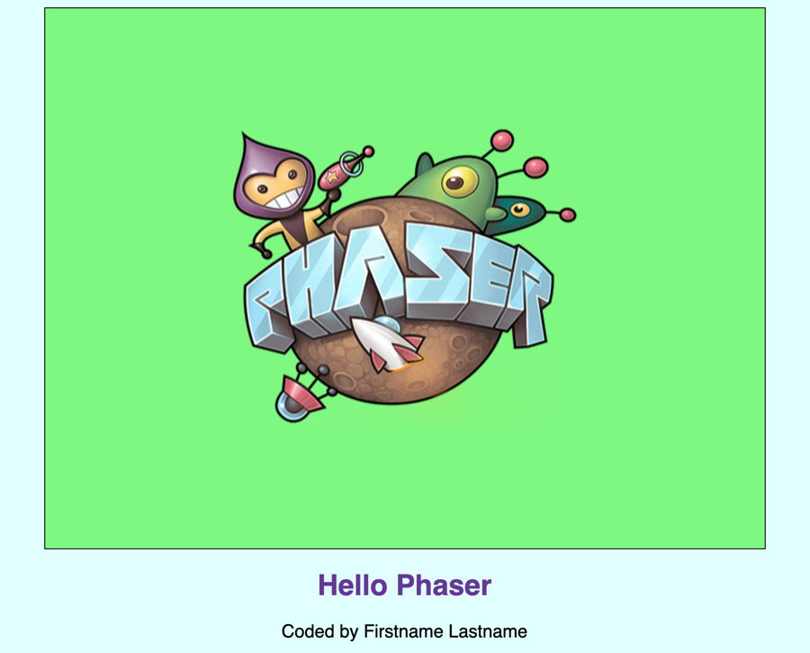

# A-6 Add Input to Game

Finally, let's add a way for a player to interact with the game by pressing a key.

Phaser CE supports the ability to detect input through a keyboard, mouse, touchscreen, or gamepad. As necessary, you can have multiple inputs \(e.g., several keys plus mouse\).

## Declare Variable for Input Key

You'll have the player use the spacebar key as an input to interact with the game. To do this, you'll first need to declare a global variable to represent this input key.

Copy this JS code, and paste it on a new line after line 5 \(which created the global variable named `logo`\):

```javascript
var spacebar;
```

This JS code statement declares \(creates\) a new global variable named `spacebar`, which will be used to represent the spacebar key on the keyboard.

## Add Input Key to Game

The next step is to add the spacebar key as an input for the game, which will allow your game to detect when this specific key is pressed by the player.

For Phaser CE games, input controls are added within the `create()` function as part of creating your game world.

Copy this Phaser CE code statement, and insert it within the `create()` function by pasting it on a new line **after** the line of code that set the anchor for the logo image:

```javascript
  spacebar = game.input.keyboard.addKey(Phaser.KeyCode.SPACEBAR);
```

This code statement actually does two things:

1. It adds an input key to the game using a specific key code.
2. It assigns that input key to your global variable named `spacebar`.

The `game.input.keyboard.addKey()` method requires one parameter inside its parentheses:

* **Key Code** — which is a code that represents a specific key on the computer keyboard. The Phaser CE API reference has a [complete list of key codes](https://photonstorm.github.io/phaser-ce/Phaser.KeyCode.html). Some examples include:
  * **Letter Keys:**  `Phaser.KeyCode.A` = letter A key
  * **Number Keys:**  `Phaser.KeyCode.ONE` = number 1 key
  * **Symbol Keys:**  `Phaser.KeyCode.PLUS` = plus symbol key
  * **Arrow Keys:**  `Phaser.KeyCode.UP` = up arrow key
  * **Function Keys:**  `Phaser.KeyCode.F1` = F1 function key
  * **Special Keys:**  `Phaser.KeyCode.TAB` = tab key

## Check Input Key During Gameplay

check input key in update\(\) function using if statement to perform certain actions when the key is pressed

```javascript
  if (spacebar.justDown) {
    game.stage.backgroundColor = Phaser.Color.getRandomColor();
  }
```

## Preview Game

Preview the game in your code editor. Depending on your code editor, you might need to refresh its preview pane. If necessary, open the preview in a new tab or window to view it in fullscreen.

Your game should change its background to a random color each time you press the spacebar key. If so, you've successfully completed the Hello Phaser tutorial!



