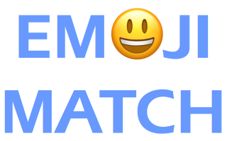
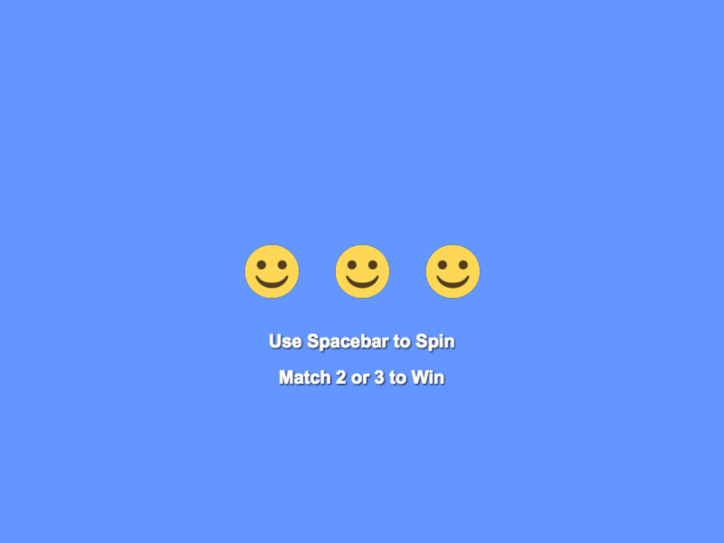

# Matching Game

It's time to introduce you to the technology that your team will be using later to develop it's own game. This will be your first practice coding a browser-based video game using the [Phaser JS game engine](http://phaser.io/).

For this practice, all the game assets \(i.e., images and sounds\) and nearly all the game code will be provided. Focus on becoming familiar with how the code works.

This first practice will create a simple game. You're going to code an emoji matching game, similar to a slot machine. This game is based entirely on chance — no player skill involved. However, it will introduce you to some of the basic concepts of using Phaser to create a game.

**PREVIEW VIDEO:** [Demo of Emoji Match](https://drive.google.com/open?id=0B8MTiM_lFG9TOEZ3XzNOU3N6anc)

## PREP STEPS

1. Complete the [Quick Setup](../quick-setup.md) for a new game.
2. Download this [assets.zip](https://drive.google.com/open?id=0B8MTiM_lFG9TTTFWZktKa0U4VEU) file, and then extract \(decompress\) the file contents, which will be a folder named **assets** that contains one image file and three sound files. \(To extract the file on a Windows computer, right-click on the downloaded zip file, and select _Extract All_. On a Mac, double-click on the downloaded zip file.\)
3. Replace the **assets** folder of your new game with this assets folder containing all the files.
4. Test your Phaser game template by previewing the HTML file online. If everything's ready to go, you should see a **solid black box** \(i.e., a blank Phaser game canvas\) on your webpage.

## CODING STEPS

This game will be coded in 10 steps. Overall, it doesn't take that much code to create this game; however, every step will explain how the code works.

In Step 1, you'll make a couple of changes to your HTML file and CSS file to demonstrate that the rest of the webpage surrounding your game can be modified. That will be useful later when your team develops its own game — you'll be able to customize the webpage to match your game's theme.

The rest of the steps are for coding your game, which will be done in your **code.js** file using Phaser JavaScript commands \(as well as regular JavaScript\).

The steps are outlined below.

* Step 1: Modify HTML and CSS 
* Step 2: Look at Starter Phaser JS Code 
* Step 3: Change Background Color of Game 
* Step 4: Add Emoji Sprite Using Image 
* Step 5: Add Player Input 
* Step 6: Add Sound Effect 
* Step 7: Add Text to Game 
* Step 8: Add Other Emoji Sprites 
* Step 9: Add Custom Function to Check for Matches 
* Step 10: Add Improvements to Game

