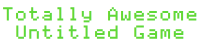

# Side-Scrolling Game

In this tutorial, you're going to create a side-scrolling game that follows the player's character as it moves through an extended game world. The instructions will help you make a partial game, which you'll need to finish designing and creating yourself. You'll also create some of your own custom assets \(sound effects and an animated sprite\) to add to your game. This practice will allow you to apply your existing knowledge of Phaser, plus show you a few more new features.

**PREVIEW VIDEO:** [Demo of Totally Awesome Untitled Game](https://drive.google.com/open?id=0B8MTiM_lFG9TanY1M21TM0s0LW8)

## PREPERATION

1. Complete the [Quick Setup](../quick-setup.md) for a new game.
2. Download this [assets.zip](https://drive.google.com/open?id=0B8MTiM_lFG9TOXpWLUVJY1NUMVk) file, and extract the file contents, which will be a folder named **assets** that has two subfolders containing 30 images and 2 sounds. Replace your empty assets folder with this assets folder. For this game, you won't necessarily use all the provided images. It will be up to you to decide whether to use some of them.
3. Test your Phaser game template by previewing the HTML file online. If everything's ready to go, you should see a **solid black box** \(your blank game canvas\) on your webpage.

## CODING STEPS

This tutorial will be coded in 15 steps. The steps are outlined below. The instructions for Steps 1-5 start on the next page.

* Step 1: Add Player Sprite and Physics 
* Step 2: Add Player Input and Movement 
* Step 3: Resize Game World and Add Background 
* Step 4: Add Platforms and Walls 
* Step 5: Add Coins and Score 
* Step 6: Add Enemy and Health Bar 
* Step 7: Add Power-Up with Timer 
* Step 8: Add Countdown Timer for Game Over 
* Step 9: Create Your Own Design for Rest of Level 
* Step 10: Add Rest of Platforms and Walls 
* Step 11: Add Obstacle to Hinder Player 
* Step 12: Add Resource to Help Player 
* Step 13: Create and Add Sound Effects 
* Step 14: Create and Add Animated Sprite 
* Step 15: Playtest and Improve Your Game

