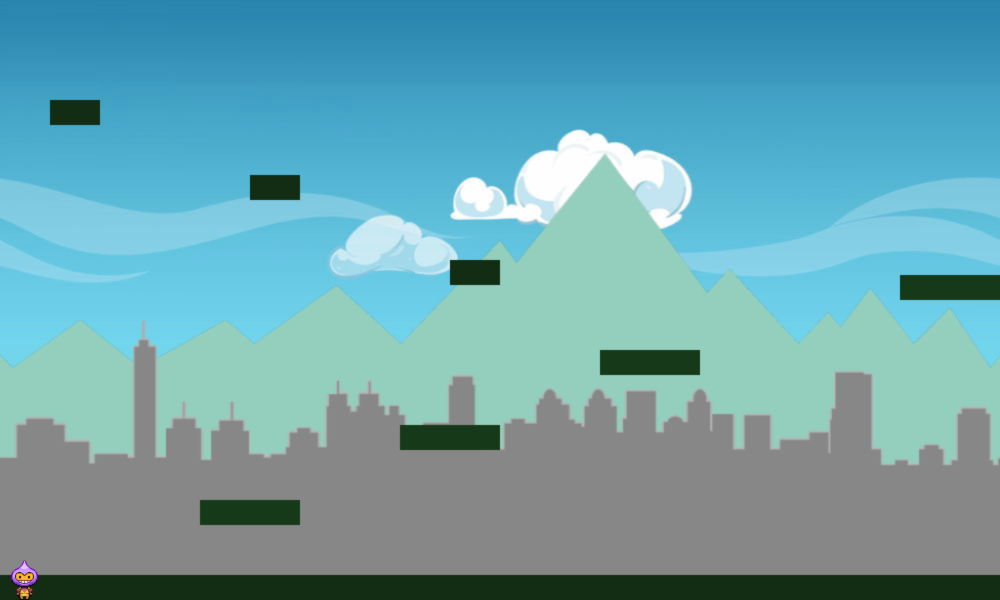

# Steps 1 - 5

## Step 1: Add Player Sprite and Physics

### Add Player Sprite

Add a sprite to represent the player's character:

* Declare a global variable named `player` for the player's sprite.
* In your `preload()` function, load **assets/images/dude.png** as the spritesheet. It contains 9 animation frames that are each 32 pixels in width and 48 pixels in height. Assign a unique asset key name to the spritesheet, such as: `'dude'`

  

* In your `create()` function, add the `player` sprite to the game at position `25, 300` using the `'dude'` asset
* Then set the sprite's anchor to its center: `0.5, 0.5`

For help with this code to add a sprite, you can refer back to Step 4 of Practice 1 \(or look at your game code for Practice 1 or Practice 2\).

**Refresh your HTML preview to verify that the player sprite is centered vertically near the left edge of the game. The sprite should display just the first frame of the spritesheet.**

### Start Physics System and Enable Physics for Player

Now let's add some physics properties to the `player` sprite.

As a reminder, we first need to start a Phaser Physics system \(Arcade, Ninja, or P2\) for the game. Then we need to enable physics on each object in the game that we want to be affected by physics \(e.g., anything that will move or will be involved in collisions\).

As the first line of code in your `create()` function, start the Arcade Physics system for your game:

```javascript
game.physics.startSystem(Phaser.Physics.ARCADE);
```

After your code that adds the `player` sprite, enable Arcade Physics for the sprite:

```javascript
game.physics.arcade.enable(player);
```

Now we can change the physics properties for the sprite's body.

### Add Gravity for Player

In this game, we want to simulate gravity by having the `player` sprite fall downwards \(if it isn't standing on something\).

The Phaser Arcade Physics system actually lets you set a `gravity` value for the `x` direction \(left-right\) and/or the `y` direction \(up-down\) of a sprite's `body`:

* Setting `body.gravity.x` to a **positive** value will cause the sprite to be pulled to the **right**.
* Setting `body.gravity.x` to a **negative** value will cause the sprite to be pulled to the **left**.
* Setting `body.gravity.y` to a **positive** value will cause the sprite to be pulled **downwards**.
* Setting `body.gravity.y` to a **negative** value will cause the sprite to be pulled **upwards**.

After the command that enabled physics on the `player` sprite, add this Phaser command to set a gravity value for the sprite:

```javascript
player.body.gravity.y = 450;
```

This command will set the player's gravity to 450 pixels per second squared in the downward direction.

**Refresh your HTML preview to verify that the player sprite will be pulled downward by gravity.**

You'll see that the gravity will keep pulling the sprite downward until it disappears out of the game. That's because there isn't anything for the sprite to collide with, in order to stop it from falling.

Phaser has a property to make a sprite's body collide with the game world boundaries. We can use this property to keep the `player` sprite from leaving the game world.

Add this Phaser command to make the `player` sprite collide with the game world boundaries:

```javascript
player.body.collideWorldBounds = true;
```

**Refresh your HTML preview to verify that the player sprite will stop moving downwards when it collides with the bottom of the game world.**

Experiment with different values for the gravity to see how it affects the sprite. Try a larger value. Try a smaller value. Try a negative value. Try changing the gravity to act in the x-direction. Try setting gravity values for both the x-direction and the y-direction. When you're done, be sure to set the gravity back to the the original value shown in the code above.

### Add Bounce for Player

Next let's make the `player` sprite bounce a bit when it collides with something after falling.

The Phaser Arcade Physics system lets you set a `bounce` value for the `x` direction \(left-right\) and/or the `y` direction \(up-down\) of a sprite's `body`.

The `body.bounce.x` and `body.bounce.y` properties are typically set to a decimal value between 0-1, which determines the rebound velocity of the sprite when it reverses direction after the bounce. Here are some examples:

* Using a `bounce` value of `1` will cause the sprite to reverse direction without losing any velocity \(speed\).
* Using a `bounce` value of `0.8` will cause the sprite to reverse direction and rebound at only 80% of its original velocity.  In other words, each bounce will reduce its velocity by 20%.
* Using a `bounce` value of `0.5` will cause the sprite to reverse direction and rebound at only 50% of its original velocity.  Therefore, each bounce will reduce its velocity by 50%.
* Using a `bounce` value of `0.25` will cause the sprite to reverse direction and rebound at only 25% of its original velocity.  Therefore, each bounce will reduce its velocity by 75%.

If you wanted, you can use a `bounce` value greater than 1, which will actually cause the sprite to rebound with a **greater** velocity with every bounce \(sort of like a person bouncing on a trampoline\).

Add this Phaser command to give the `player` sprite a small amount of `bounce` in the `y` direction:

```javascript
player.body.bounce.y = 0.1;
```

**Refresh your HTML preview to verify that the player sprite will bounce slightly when it collides with the bottom of the game world.**

Experiment with different values for the bounce to see how it affects the sprite. Try a value of 1. Try a value of 0.5. Try a value of 1.1 to see what happens. When you're done, be sure to set the bounce back to the the original value shown in the code above.

## Step 2: Add Player Input and Movement

This game will use the keyboard arrow keys as the inputs for the `player` sprite movement:

* Pressing the **left** arrow key will move the sprite to the left.
* Pressing the **right** arrow key will move the sprite to the right.
* Pressing the **up** arrow key will make the sprite jump up.
* Pressing the **down** arrow key won't do anything \(unless you decide later to add an action for this\)

### Add Cursor Keys \(Arrows\) as Inputs

Add code to make the arrow keys into inputs:

* Declare a global variable named `arrowKey` for the arrow key inputs.
* In your `create()` function, add the Phaser command make the cursor keys \(arrows\) into inputs assigned to the `arrowKey` variable.

For help with this code to add the cursor keys \(arrows\) as inputs, you can refer back to Step 2 of Practice 2 \(or look at your Practice 2 game code\).

### Velocity Property

For this game, we're going to use the `velocity` property to move the `player` sprite left or right \(and to jump up\).

The Phaser Arcade Physics system lets you set a `velocity` value for the `x` direction \(left-right\) and/or the `y` direction \(up-down\) of a sprite's `body`:

* Setting `body.velocity.x` to a **positive** value will make the sprite move to the **right**.
* Setting `body.velocity.x` to a **negative** value will make the sprite move to the **left**.
* Setting `body.velocity.y` to a **positive** value will make the sprite move **down**.
* Setting `body.velocity.y` to a **negative** value will make the sprite move **up**.

As we typically do in a game, we'll use a series of [if-else conditional statements](https://www.w3schools.com/js/js_if_else.asp) to check the player inputs, in order to determine which direction to move the sprite.

Logically, there should be three possibilities for moving the `player` sprite right or left: \(1\) the right arrow key is being pressed, \(2\) the left arrow key is being pressed, or \(3\) neither the right nor the left arrow key is being pressed.

Of course, in reality, the player might happen to press both the left and right arrow keys at the same time. To handle this situation, we need to decide whether our code should cause the player sprite to stop moving \(make the two keys cancel each other\) — or whether the code should prioritize one of the keys over the other.

In this game, the `player` will start at the far left of the game world and will need to move to through the game world to the far right end. Most of the time the player will be trying to move to the right. However, it's also common for a player to accidentally press more than one key at a time.

So for both of these reasons, it would probably be best in this game to prioritize the **right** arrow key over the left arrow key, in the event that both are pressed at the same time. An easy way to prioritize the right arrow key is to check it first before checking the left arrow key.

### Add Player Left and Right Movement

In your `update()` function, add if-else conditional statements with Phaser commands to move the `player` sprite left or right based on the `arrowKey` inputs:

* **If** the right arrow key is pressed down, set the sprite's `body.velocity.x` to `200`, like this:

  ```javascript
  player.body.velocity.x = 200;
  ```

* **Else if** the left arrow key is pressed down, set the sprite's `body.velocity.x` to `-200`
* **Else** set the sprite's `body.velocity.x` to `0`

For help with this code, you can refer back to Step 3 of Practice 2 \(or look at your Practice 2 game code\). Just keep in mind that this game will use `body.velocity.x` instead of `body.angularVelocity` to move the player left and right.

**Refresh your HTML preview to verify that you can use the left and right arrow keys to move the player sprite left or right. When neither key is pressed, the sprite should stop.**

Experiment with different values for the velocity to see how it affects the speed of the sprite. Try a larger value. Try a smaller value. When you're done, be sure to set the velocity back to the the original value shown in the code above.

You'll notice that the `player` sprite still just displays the first frame of its spritesheet \(which shows the character facing to the left\). That's because we haven't added any animations yet, but we'll do that in just a bit.

### Add Player Jump

In your `update()` function, add Phaser commands to make the `player` sprite jump:

* **If** the up arrow key was just pressed down, set the sprite's `body.velocity.y` to `-300`

**Hint:** Refer back to Step 5 of Practice 1 for the difference between a key is being pressed down versus was just pressed down.

Notice that we did not include an else statement to set `body.velocity.y` to zero when the up arrow key isn't pressed. The reason is that the `body.gravity.y` will automatically slow down the `player` sprite's upward velocity and eventually make the sprite fall downwards, just how gravity actually works in the real world when you jump up.

**Refresh your HTML preview to verify that you can use the up arrow key to make the player sprite jump up. The player's gravity should make the sprite fall back down again.**

You probably discovered that you can press the up arrow key multiple times to keep jumping, even when the sprite is in mid-air. Obviously, this is **not** realistic for jumping \(though it would be realistic for a sprite that was supposed to be flying or swimming\). We'll fix this later when we get to Step 4.

Experiment with different values for the velocity to see how it affects the speed and height of the jump. Try a larger value. Try a smaller value. Also try changing the gravity value to see how it affects the jump. When you're done, be sure to set the velocity and gravity back to the the original values shown in the code above.

### Add Player Animations

In your `create()` function \(after the code that adds the `player` sprite\), add code to create two animations for the `player` sprite:

* Add an animation named `'left'` to play frames 0-3 \(in order\) at 10 frames per second in a loop.
* Add an animation named `'right'` to play frames 5-8 \(in order\) at 10 frames per second in a loop.

Inside your if-else statements in your `update()` function, add Phaser commands to do the following:

* When the `player` sprite is moving to the right, play the `'right'` animation.
* When the `player` sprite is moving to the left, play the `'left'` animation.
* When the `player` sprite is **not** moving, stop the animations, and set the sprite to display frame `4` \(which shows the character facing us\).

For help with this code, you can refer back to Step 3 of Practice 2 \(or look at your Practice 2 game code\).

**Refresh your HTML preview to verify that the correct animation plays when you move the player sprite left or right. When the sprite is not moving, the sprite should face you \(which is frame 4\).**

## Step 3: Resize Game World and Add Background

Some games are single-screen games, where the game display represents the entire game world. Practice 1 \(Emoji Match\) and Practice 2 \(Asteroids 2084\) were both like this. However, for Practice 3, your game world will extend beyond the size of the game display.

### Resize Game Display \(Game Stage and Game Camera\)

The size of the game display is set when you create your Phaser.Game object \(named `game`\).

The beginning of your **code.js** file already contains this statement \(_so don't copy and paste this a second time_\):

```javascript
// Do NOT copy-and-paste - this is already in your code
// create Phaser.Game object named "game"
var game = new Phaser.Game(800, 600, Phaser.AUTO, 'my-game',
    { preload: preload, create: create, update: update });
```

The numbers `800, 600` set the width and height \(in order\) of the game display. This makes your game display 800 pixels in width by 600 pixels in height. This represents the size of your [Game.Stage](https://photonstorm.github.io/phaser-ce/Phaser.Stage.html) and your [Game.Camera](https://photonstorm.github.io/phaser-ce/Phaser.Camera.html).

First, you're going to make your game display a little bit wider:

* Modify your existing Phaser.Game object statement to make your game display `1000` pixels in width by `600` pixels in height.
* If you also used the starter CSS code which applies a width to `#my-game`, then modify your CSS so this width is also set to `1000` pixels. 

**Refresh your HTML preview to verify that your game display is now slightly wider. \(It may be necessary to increase the width of your code editor preview pane, in order to see the whole game display.\)**

### Resize Game World

Next, you're going to make your game world wider than the game display itself.

Phaser allows you to make the width and/or height of your [Game.World](https://photonstorm.github.io/phaser-ce/Phaser.World.html) larger than the game display. Phaser can also automatically scroll the game display as the player moves through the game world.

At the beginning of your `create()` function \(after the command that started the Arcade Physics system\), add this Phaser command:

```javascript
game.world.setBounds(0, 0, 5000, 600);
```

As you can see, this Phaser command resizes the game world:

* The first two numbers `0, 0` represent \(in order\) the `x` and `y` position of the top-left corner of your game world. \(Typically, you'll use `0, 0` for your top-left corner.\)
* The last two numbers `5000, 600` represent \(in order\) the width and height \(in pixels\) of your game world. This can be set to any values that you want. Typically, the width and height are each set to be greater than or equal to the width and height of the game display.

**Refresh your HTML preview to verify that the player sprite can move to the right out of the game display \(traveling off into the rest of the game world\) and can then move left back into the game display again.**

### Make Game Camera Follow Player

Normally, when the game world is larger than the game display, we'll want the game display to automatically scroll to follow the player.

In your `create()` function \(after the code that adds the `player` sprite\), add this Phaser command:

```javascript
game.camera.follow(player);
```

To help convince you that the game world is actually larger, add this **temporary** code at the end of your `create()` function:

```javascript
    // TEMPORARY - distance markers
    game.add.text(1000, 300, '1000px', { fill: 'white' });    
    game.add.text(2000, 300, '2000px', { fill: 'white' });    
    game.add.text(3000, 300, '3000px', { fill: 'white' });    
    game.add.text(4000, 300, '4000px', { fill: 'white' });
```

**Refresh your HTML preview to verify that the player sprite can move back and forth throughout the entire game world \(5000 pixels in width\) and the game display camera will automatically follow the player.**

### Add Background Images as Tilesprites

You're going to add and layer several images to form the background for your game. In the **images** subfolder inside your **assets** folder, take a look at these 3 images:

* **sky-clouds.jpg** is an image of a blue sky with some clouds
* **mountain-skyline.png** is an image of a green mountain range. Note that the "sky" portion of this image is actually transparent \(so it will show whatever color or images are behind it\). The image preview might show the transparent area as a checkerboard pattern.
* **city-skyline.png** is an image of tall city buildings in silhouette. Note that the "sky" portion of this image is also transparent.

All three images are exactly 1000 pixels in width and 600 pixels in height, which is also the exact size of your game display. All three images have also been designed for "seamless" scrolling \(their left and right edges match up perfectly\).

Near the top of your **code.js** file, add global variables for the following:

* `sky`
* `mountains`
* `city`

**Hint:** You can add all 3 variables at once with one line of code, like this:

```javascript
var sky, mountains, city;
```

In your `preload()` function, add Phaser commands to:

* Load **assets/images/sky-clouds.jpg** as an image, and assign it a unique asset key name, such as `'sky'`
* Load **assets/images/mountain-skyline.png** as an image, and assign it a unique asset key name, such as `'mountains'`
* Load **assets/images/city-skyline.png** as an image, and assign it a unique asset key name, such as `'city'`

In your `create()` function \(after the command that set the game world boundaries\), add a Phaser command to:

* Add a tilesprite assigned to the `sky` variable that will be positioned at `0, 0`, set to a width and height of `1000, 600`, and use the `'sky'` image asset.

For help with this code to add a tilesprite, you can refer back to Step 4 of Practice 2 \(or look at your game code for Practice 2\).

**Refresh your HTML preview to verify that sky and clouds image appears in the game. If you move the player sprite to the right, you will see that the sky tilesprite only covers the first 1000 pixels of the game's width. \(We'll take care of this in a little bit.\)**

Next you'll add the mountains image in front of the sky image.

As a reminder, when you create your game world, all the visual objects — such as images, sprites, text, etc. — are added to the game display in layers \(meaning they can overlap other objects behind them\). The order in which they are added in the `create()` function determines the stacking of these layers in the game world.

Whichever visual object is added first in the `create()` function will be the farthest back layer. Each new visual object \(image, sprite, etc.\) that is added in the code will appear in front of the previous layers.

In your `create()` function \(after the command that added the `sky` tilesprite\), add a Phaser command to:

* Add a tilesprite assigned to the `mountains` variable that will be positioned at `0, 0`, set to a width and height of `1000, 600`, and use the `'mountains'` image asset.

**Refresh your HTML preview to verify that the mountains image appears in front of the sky and clouds \(which are partially visible due to the transparent "sky" area in the mountains image\).**

Now you'll add the city image in front of the mountains image.

In your `create()` function \(after the command that added the `mountains` tilesprite\), add a Phaser command to:

* Add a tilesprite assigned to the `city` variable that will be positioned at `0, 0`, set to a width and height of `1000, 600`, and use the `'city'` image asset.

**Refresh your HTML preview to verify that the city image appears in front of mountains. Both the mountains and the sky/clouds are partially visible due to the transparent "sky" area in the city image\).**

### Make Tilesprites Fixed to Camera

To cover the entire background of the game world, there are a few options:

* We could add the same images several more times at new positions spaced out 1000 pixels apart in the x-direction \(so that we cover all 5000 pixels of the game world width\).
* We could add different images at positions spaced out across the game world width. This would be useful if we want to have the player travel through different backgrounds \(such as a city, then a forest, then a desert, then a night-time scene, etc.\).
* We could make the images stay in place by "fixing" them to the game camera, so the images stay in view even as the player moves around the game world.

For this game, we're going to use the third option.

In your `create()` function \(after the commands that added the tilesprites\), add this Phaser code:

```javascript
sky.fixedToCamera = true;
```

**Refresh your HTML preview to verify that the sky image stays fixed in place as the player moves through the game world. However, the mountains and city images won't stay fixed \(yet\).**

Add similar Phaser commands to make the `mountains` and `city` stay fixed to the camera.

**Refresh your HTML preview to verify that the sky, mountains, and city all stay fixed in place as the player moves through the game world.**

### Add Parallax Scrolling to Tilesprites

Now our game has a background that covers the entire game world \(by staying fixed in place\).

The only problem is that a completely static, non-moving background doesn't feel realistic. In the real world, objects in the background appear to shift slowly as we move. Currently, our background doesn't budge at all.

As you remember from Practice 2, tilesprites are designed to be used for scrolling, so we can add code to do that. However, even that still might not feel entirely realistic.

In the real world, we experience a visual phenomenon called **parallax** — more distant objects seem to shift or move more slowly compared to closer objects. So if we have clouds in the distant background, then mountains a bit closer, and a city skyline even closer, they should each appear to shift or move at different rates as we move by them.

We can simulate parallax in our game code by scrolling the tilesprites at different rates. The `sky` tilesprite should move more slowly because it is supposed to be the "farthest" away. The `city` tilesprite should move more quickly because it is supposed to be the "closest" to the player.

Furthermore, we need to scroll the tilesprite positions in the **opposite** direction of the player's motion. So if the player sprite is moving to the right, the background tilesprites should appear to scroll to the left.

In your `update()` function \(after the if-else statements for the player movement\), add this Phaser code:

```javascript
    // BACKGROUND PARALLAX    
    sky.tilePosition.x = game.camera.x * -0.2;
    mountains.tilePosition.x = game.camera.x * -0.3;
    city.tilePosition.x = game.camera.x * -0.4;
```

This code will scroll the positions of the tilesprites relative to the game camera position \(which is following the player\). The negative numbers cause the tilesprite to scroll in the opposite direction of the player's movement. A smaller number will cause a tilesprite to scroll at a slower rate than a larger number, so the tilesprites will each scroll at different rates, with the `sky` scrolling more slowly and the `city` scrolling more quickly.

**Refresh your HTML preview to verify that the sky, mountains, and city scroll at different rates as the player moves through the game world, simulating a parallax effect, which will seem more realistic.**

Experiment with different values for the tilesprite scrolling to see how it affects the speed and realism of the parallax scrolling. Try larger values. Try smaller values. Try using the same value for all three tilesprites \(which will seem less realistic because it won't have any parallax\). When you're done, be sure to set the scrolling back to the the original values shown in the code above.

## Step 4: Add Platforms and Walls

The game world will have a series of floating platforms that the player sprite can run and jump on to move through the level and collect various resources.

The platforms will simply be dark green rectangles \(though you could replace them with another image\). Inside the **images** subfolder of your **assets** folder are several platform images. They are all rectangles 25 pixels in height, but they range in width from 50 pixels up to 500 pixels.

You'll add a [Phaser group](https://photonstorm.github.io/phaser-ce/Phaser.Group.html) to your game that will contain all the platforms. Remember that a Phaser group is simply a set of game objects with similar properties, such as a set of enemy sprites, etc. You'll be adding several different groups to your game.

Declare a global variable named:

* `platformGroup` \(will contain all the platform objects\)

In your `preload()` function, load these images for the platforms:

* Load **assets/images/platform-050w.png** with `'platform-50'` as its asset key
* Load **assets/images/platform-100w.png** with `'platform-100'` as its asset key
* Load **assets/images/platform-200w.png** with `'platform-200'` as its asset key
* Load **assets/images/platform-300w.png** with `'platform-300'` as its asset key
* Load **assets/images/platform-400w.png** with `'platform-400'` as its asset key
* Load **assets/images/platform-500w.png** with `'platform-500'` as its asset key

### Add Platform Group

Now you're ready to add the `platformGroup` to the game. Remember that visual objects in the game world are layered in the order that they are added within the `create()` function. So you'll want to add the `platformGroup` after the background tilesprites but before the player sprite.

Add this Phaser code in your `create()` function \(**after** the code that adds the background tilesprites, but **before** the code that adds the player sprite\):

```javascript
    // PLATFORMS
    platformGroup = game.add.group();
    platformGroup.enableBody = true;

    // add ground platform
    var ground = platformGroup.create(0, game.world.height - 25, 'platform-500');
    ground.scale.setTo(10, 1); // 10 * 500 = 5000 pixels wide
```

This code does several things:

* The first line of code adds a new group assigned to the `platformGroup` variable.
* The second line of code enables physics for every member in the `plaftformGroup` \(this can be done in advance, even before you add any members to the group\)
* The third line of code creates a member in the `platformGroup` at x-y position `0, 575` \(`0` is the far left x-position, and `575` is 25 pixels up from the bottom y-position\) using the `'platform-500'` asset \(which is a rectangle image 500 pixels in width and 25 pixels in height\).  This member of the group is assigned to a local variable called `ground`.  Remember that by default, the top-left corner of an object represents its position \(unless you change the objects's anchor to a different position, such as the object's center\).
* The fourth line of code scales the `ground` object to fit across the entire bottom of the game world. The image for `ground` will be scaled to `10` times its width and `1` times its height, so the image will become 5000 pixels wide, while keeping its same height of 25 pixels.

**Refresh your HTML preview to verify that a platform appears across the bottom of the game world.**

You will notice that the `player` sprite doesn't stand on top of the platform — that's because we haven't yet instructed the game to make the `player` collide with the `platformGroup`. We'll do that in just a bit after we add some more platforms.

Add this code to create more objects in the `platformGroup`:

```javascript
    // add platforms
    platformGroup.create(200, 500, 'platform-100');
    platformGroup.create(400, 425, 'platform-100');
    platformGroup.create(600, 350, 'platform-100');
    platformGroup.create(50, 100, 'platform-50');
    platformGroup.create(250, 175, 'platform-50');
    platformGroup.create(450, 260, 'platform-50');
    platformGroup.create(900, 275, 'platform-200');
    platformGroup.create(1150, 475, 'platform-50');
    platformGroup.create(1350, 500, 'platform-50');
```

This code creates 9 new members in the `platformGroup`. The numbers represent the x and y positions \(in order\) of the top-left corner of the object. The members use different image assets \(depending on how wide we want each platform to be\).

Notice that for this code, we did not use a local variable \(such as `ground`\) to create each platform. However, if we had needed to modify specific properties of a platform \(such its scale, etc.\), then we would have needed to assign the platform to a variable, so we could then use the variable name to change the properties of the specific platform object.

**Refresh your HTML preview to verify that the other platforms appear in the game. \(The player still doesn't interact with the platforms in any way.\)**

The beginning of your game world should look like this \(plus you'll have two other small platforms off-screen to the right\):



### Add Player Collision with Platforms

Now let's make the player collide with the platforms. This will allow the player to stand, run, and jump on the platforms.

Add this Phaser command in your `update()` function \(before the if-else statements that check for keyboard input by the player\):

```javascript
game.physics.arcade.collide(player, platformGroup);
```

**Refresh your HTML preview to verify that the player sprite now collides with the platforms. However, you will notice that the platforms do not stay in place.**

When the player sprite collides with the platforms, the player pushes and moves the platforms \(which can even cause them to leave the game world\).

### Make Platforms Immovable

For some games, a platform that "collapses" or that can be "pushed" might be exactly what you want. However, for this game, we want all the platforms to be immovable.

Add this Phaser command in your `create()` function \(after the code that created the platforms\):

```javascript
platformGroup.setAll('body.immovable', true);
```

The `setAll()` methods allows you to change the value of a property for every member in a group. Inside the parentheses, you first list the name of the property \(in quotes\) and then list the value that you want to set for the property. In this case, the property `body.immovable` for each group member will be set to the value of `true`.

**Refresh your HTML preview to verify that the platforms are now immovable and stay in place when the player collides with them, allowing the player to jump onto the platforms.**

### Prevent Player from Jumping in Mid-Air

Next, let's fix the issue with the player's jump: we don't want the player to be able to keep jumping while in mid-air. Instead we only want the player to be able to jump if the player sprite is on a platform \(or another object\).

Luckily, Arcade Physics has a built-in property to detect if a sprite's body is touching \(i.e., colliding with\) another object. This property can detect touching along each side of the sprite:

* `player.body.touching.up` will be `true` if the **top** of  `player` is touching another object
* `player.body.touching.down` will be `true` if the **bottom** of `player` is touching another object
* `player.body.touching.left` will be `true` if the **left** of `player` is touching another object
* `player.body.touching.right` will be `true` if the **right** of `player` is touching another object
* `player.body.touching.none` will be `true` if `player` is **not** touching any object

So we can use `player.body.touching.down` to detect when the `player` sprite is standing on a platform \(or any other object\).

In your `update()` function, modify your existing if statement that checks whether the up arrow key has just been pressed, so it looks like this:

```javascript
    if (arrowKey.up.justDown && player.body.touching.down) {
        // make player jump
        player.body.velocity.y = -300;
    }
```

Now, in order to jump, the up arrow key has to have been just pressed down AND the bottom of the player sprite has to be touching another object \(such as a platform\).

**Refresh your HTML preview to verify that player's character can only jump when it is on top of the ground or another platform.**

### Prevent Player from Colliding with Top of Game World

There's one other minor fix that we're going to make. If the `player` sprite is on a platform near the top of the game, the `player` might collide with the upper game world boundary when the `player` jumps. This is because we included a command to make the `player` sprite's body collide with the game world boundaries.

Arcade Physics has a command that allows you to turn off the collision for a particular game boundary, such as `up`, `down`, `left`, or `right`. This command affects all sprites that are set to collide with the game world boundaries.

Add this Phaser command to your `create()` function \(after the command that starts the Arcade Physics system\):

```javascript
game.physics.arcade.checkCollision.up = false;
```

**Refresh your HTML preview to verify that player's character won't collide with the top game world boundary if the character jumps up while standing on a platform near the top.**

### Add Wall Group

Now you're going to add another group, which will contain walls.

Similar to the platforms, the walls will simply be dark green rectangles \(though you could replace them with another image\). Inside the **images** subfolder of your **assets** folder are several wall images. They are all rectangles 25 pixels in width, but they range in height from 50 pixels up to 250 pixels.

Declare a global variable named:

* `wallGroup` \(will contain all the wall objects\)

In your `preload()` function, load these images for the walls:

* Load **assets/images/wall-050h.png** with `'wall-50'` as its asset key
* Load **assets/images/wall-150h.png** with `'wall-150'` as its asset key
* Load **assets/images/wall-250h.png** with `'wall-250'` as its asset key

In your `create()` function, add code to do the following \(**after** the code that adds the platforms, but **before** the code that adds the player sprite\):

* Add `wallGroup` to the game
* Enable physics for all members of `wallGroup`
* Create a member in `wallGroup` at position `525, 525` using asset `'wall-50'`
* Create a member in `wallGroup` at position `1000, 425` using asset `'wall-150'`
* Create a member in `wallGroup` at position `2000, 525` using asset `'wall-50'`
* Create a member in `wallGroup` at position `3000, 525` using asset `'wall-50'`
* Create a member in `wallGroup` at position `4000, 525` using asset `'wall-50'`
* Set all the members of `wallGroup` to have their `'body.immovable'` property set to a value of `true`

In your `update()` function, add code to do the following:

* Make `player` and `wallGroup` collide with each other

**Refresh your HTML preview to verify that the 5 walls appear in the game and that the player sprite collides with the walls.**

At this point, you can delete the temporary code in your `create()` function that added the distance marker text \(1000px, 2000px, etc.\).

**Refresh your HTML preview to verify the distance marker text \(1000px, 2000px, etc.\) is gone.**

## Step 5: Add Coins and Score

The game will have coins that the player can collect for points. You'll create a Phaser group for the coins. You'll add some physics properties and a spinning animation to the coins.

### Add Group for Coins

Declare a global variable named:

* `coinGroup` \(will contain all the coin objects\)

In your `preload()` function, load the spritesheet for the coins:

* Load **assets/images/coin.png** as a spritesheet. Use `'coin'` as the asset key. The image contains 6 animation frames in a single row. The entire image is 192 pixels in width and 32 pixels in height. Use this information to determine the width and height of each frame.

  

In your `create()` function, add code to do the following \(**after** the code that adds the walls, but **before** the code that adds the player sprite\):

* Add `coinGroup` to the game
* Enable physics for all members of `coinGroup`

### Add Coins to Group using JSON Data

Next you're going to add members to the `coinGroup`. However, instead of using a series of `coinGroup.create()` statements \(like how you added the platforms and walls\), you're going to use a JSON array that stores data for the x-y position of all the coins.

Add this code to your `create()` function \(after the command that enabled physics for `coinGroup`\):

```javascript
    // JSON array listing coin positions
    var coinData = [
        { x:75, y:0 },
        { x:150, y:0 },
        { x:250, y:250 },
        { x:275, y:0 },
        { x:350, y:0 },
        { x:450, y:300 },
        { x:475, y:0 },
        { x:537, y:0 },
        { x:650, y:0 },
        { x:700, y:400 },
        { x:850, y:0 },
        { x:950, y:0 },
        { x:1050, y:0 },
        { x:1175, y:0 },
        { x:1375, y:0 }
        // no comma after last item in array
    ];
```

This code creates a local variable named `coinData` which is an array containing [JSON data](https://www.w3schools.com/js/js_json_syntax.asp) for each coin to be added to the game.

Square brackets `[ ]` are used to contain the items in an array. Within the array, the JSON data for each item is listed inside curly braces `{ }` using **name-value pairs**: the name of a variable followed by its value. A colon is used to separate the variable name and its value.

Within the JSON data for an item, a comma is used to separate different name-value pairs \(so you can list multiple variables for each item\). As you can see, the JSON data list an `x` and `y` variable for each coin. If you were using variables that have strings \(text\) for their values, then list the values within quotes.

Commas are also used to separate the different items within the array \(i.e., the comma that appears after the right-hand curly brace\). Notice that you don't include a comma after the last item in the array.

In the example code above, we've listed the JSON data for each item on its own separate line, but you could list multiple items per line \(as shown below\) to save vertical space in your code.

```javascript
    // Do NOT copy-and-paste again (same data)
    // JSON array listing coin positions
    var coinData = [
        { x:75, y:0 }, { x:150, y:0 }, { x:250, y:250 },
        { x:275, y:0 }, { x:350, y:0 }, { x:450, y:300 },
        { x:475, y:0 }, { x:537, y:0 }, { x:650, y:0 },
        { x:700, y:400 }, { x:850, y:0 }, { x:950, y:0 },
        { x:1050, y:0 }, { x:1175, y:0 }, { x:1375, y:0 }
        // no comma after last item in array
    ];
```

Each item in an array is identified using an index number, which represents the order in which the items are listed. The first item in an array is always numbered as index `0`. Since there are 15 items listed in this array, they are numbered in order as 0-14. For example, `coinData[1]` actually refers to the 2nd item in the array, which is the data: `{ "x":150, "y":0 }`

The variable values for an item in an array can be referenced by using the item's array index number followed by a period and then the variable name. For example, `coinData[1].x` is `150` and `coinData[1].y` is `0`.

Now you're going to loop through this JSON array to use the data to add coins to `coinGroup`.

Add this code to your `create()` function \(after the code listing the JSON array for `coinData`\):

```javascript
    for (var i = 0; i < coinData.length; i++) {
        var coin = coinGroup.create(coinData[i].x, coinData[i].y, 'coin');

    }
```

This `for` loop will iterate through the entire `coinData` array, using `i` to represent the index number of the current item: `i` will start at `0` and increase by one after each loop \(`i++`\) until it reaches the end of the array \(which is represented by `coinData.length`\).

Inside the `for` loop a local variable named `coin` is created as a new member in the `coinGroup` using the `x` and `y` values stored in `coinData[i]`.

There is some missing code inside the `for` loop that you will add in just a bit.

**Refresh your HTML preview to verify that the 15 coins appear in the game at the positions listed in the coinData array.**

Most of the coins will appear along the top of the game, while a few appear in mid-air.

### Add Physics Properties and Animation to Coins

Now you'll add the missing code inside the `for` loop to give each coin some physics properties and an animation.

Inside your `for` loop \(after the command that creates the coin in the `coinGroup`\), add code to do the following for each `coin`:

* Set the anchor for `coin` to be its center \(`0.5, 0.5`\)
* Set its `body.gravity.y` to `400`
* Set its `body.bounce.y` to `0.5`
* Add an animation named `'spin'` that will play frames 0-5 \(in order\) at 10 frames per second in a loop
* Play the `'spin'` animation

Next, you need to make sure the coins collide with the platforms and walls, similar to what you did for the player.

In your `update()` function \(after the `collide()` statements for the `player`\), add code to do the following:

* Make `coinGroup` and `platformGroup` collide with each other
* Make `coinGroup` and `wallGroup` collide with each other

**Refresh your HTML preview to verify that the coins fall, bounce, and spin. The coins should collide with the platforms and walls.**

### Add Score Text

Declare a global variable named:

* `score` and assign it an initial value of `0`
* `scoreText` \(used to display score on-screen\)

In your `create()` function, add code to the following:

* Add `scoreText` to the game as text with these properties:
  * The text should be positioned at: `20, 20`
  * The text should display: `'Score: ' + score`
  * The text should use this style: `{ fontSize: '20px', fill: '#222222' }` \(by default, Phaser will use Arial bold for the font unless you change to a different font or fontWeight\)
* Make `scoreText` stay fixed to the camera \(so it doesn't move when the game world scrolls\)

**Refresh your HTML preview to verify that "Score: 0" appears at the upper-left of the game screen and stays fixed in place, even as the game world scrolls.**

### Add Custom Function for Player to Collect Coins

When the `player` sprite collides with a coin, the coin should disappear and the player's score should increase.

Add this code in your `update()` function \(after the other `collide()` statements\):

```javascript
game.physics.arcade.collide(player, coinGroup, collectCoin, null, this);
```

This `collide()` command will call a custom function named `collectCoin` whenever the `player` collides with a member of the `coinGroup`.

Add this code after your `update()` function to create the custom function:

```javascript
function collectCoin(player, coin) {

}
```

Inside the curly braces `{ }` of your `collectCoin()` function, add code to do the following:

* Remove the `coin` using the `kill()` method
* Increase the `score` by `50`
* Update the `text` property of `scoreText` to display:  `'Score: ' + score`

**Refresh your HTML preview to verify the player can collect the coins and the score increases by 50 for each coin.**

If you wanted to add a sound effect when the player collects a coin, you would add a command to play the sound inside the `collectCoin()` function.

**Continue to Steps 6-10**

