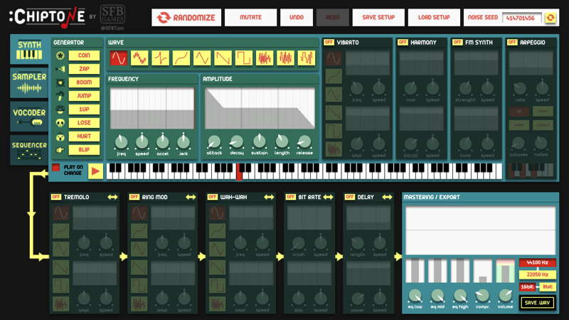
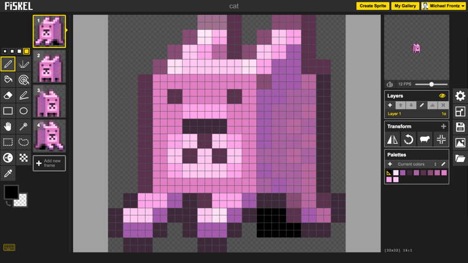

# Steps 11 - 15

## Step 11: Add Obstacle to Hinder Player

Add at least one **new obstacle** that hinders the player in some way. For example, add a spike, new enemy, etc. that the player must avoid.

* The obstacle could be an individual object or group of objects.
* Be sure to add the obstacle\(s\) at the desired location\(s\) in the game. Also be sure to set whatever properties are necessary for the obstacle\(s\).
* Be sure to add the necessary `collide()` or `overlap()` method to detect when the player has encountered the obstacle. You’ll also need to create a custom function to perform whatever actions should occur when the obstacle is encountered.

## Step 12: Add Resource to Help Player

Add at least one **new resource** that helps the player’s character in some way. For example, add a diamond or health pack that the player can collect, a weapon that the player can use, allies that help the player, etc.

* The resource could be an individual object or group of objects.
* Be sure to add the resource\(s\) at the desired location\(s\) in the game, and set whatever properties are necessary for the resource\(s\).
* Be sure to add the necessary `collide()` or `overlap()` method for the resource. You’ll also need to create a custom function to perform whatever actions should occur when the resource is collected or used.

Also be sure to add **more coins** throughout the rest of the level.

* You'll need to add the x-y position of each new coin as additional JSON data within the `coinData` array. Refer back to Step 5.

## Step 13: Create and Add Sound Effects

Add at least two **new sound effects** to the game.

* \(1\) Add code to play a sound effect when the player collects a coin.
  * Use `coinSound` as the variable name for the audio
  * Use a copy of the **coin.wav** audio file from your Practice 1 game.
* \(2\) Add code to play a sound effect when the player collects a power-up.
  * Use `powerUpSound` as the variable name for the audio
  * Use a copy of the **power-up.wav** audio file from your Practice 1 game.
* Be sure to place the audio files into the **sounds** subfolder of your game's **assets** folder.
* **Optional:** Add code to play a sound effect when the player jumps. You can use an open-source audio file, or create your own sound effect.
* **Optional:** Add music or other sound effects to the game.

### Find Open-Source Audio Files

[Freesound](http://freesound.org/) is a website that allows people to share open-source audio files. You can search for and download free-to-use audio files.

* You will need to create a free account in order to download files.
* You want the audio files to be either MP3 or WAV files. \(If absolutely necessary, you can use [Zamzar](http://www.zamzar.com/) to convert the files to the correct format.\)
* You should check the length \(time\) of the sound — so it's not too short or too long.
* You should check the size of the file — so it's not too large. Try to use files that are less than 1 MB \(ideally less than 100 KB\). Large sound files can slow down your game.

### Create Your Own Sound Effects Using ChipTone

[ChipTone](http://sfbgames.com/chiptone) is a web app that allows you to create and download your own sound effects as WAV files.

ChipTone has lots of features, but the best way to learn how to use it is to simply play around with different settings:

* You can change the sound type \(such as: coin, zap, boom, etc.\).
* You can change the wave form. Clicking a second time on the same wave form will reverse its shape.
* You can select a different note \(tone\) on the keyboard.
* You can turn various effects \(vibrato, harmony, etc.\) on or off. Each effect has its own settings that can be adjusted. You can combine effects.

Once you have a sound that you want to use, click the "Save .WAV" button in the lower-right to download the sound file.

**NOTE:** The ChipTone website requires the Adobe Flash plug-in. Google Chrome has Flash built-in, but you might need to grant access for ChipTone to use Flash. If ChipTone doesn't load:

* Open the Settings for Chrome \(click 3-dot icon at upper-right, and select Settings\).
* At the bottom of the Settings, click Advanced.
* In the Privacy and Security section, click Content Settings. Then click Flash.
* Be sure "Allow sites to run Flash" is toggled on \(to the right\).
* Add **sfbgames.com** to your list of allowed websites for Flash.

## Step 14: Create and Add Animated Sprite

**OPTIONAL:** Create a new animated sprite for an object in the game — or modify an existing animated sprite \(player, cat, etc.\) — or convert a non-animated image \(diamond, etc.\) into an animated sprite.

* The new \(or modified\) sprite should have at least 4 animation frames. For example, you could have 2 animation sequences \(such as “left” and “right”\) with at least 2 frames each — or you could have 1 animation sequence with at least 4 frames. \(Of course, you can have more than 4 frames total.\)
* Keep in mind that all the animation frames for a sprite must have the same width and same height. \(For example, each of the frames in the existing `player` spritesheet are 32 pixels in width and 48 pixels in height.\) You decide which size to use, but each frame will have to use that same size.
* Be aware that it can take a fair amount of time to create or modify animation frames, since you are typically drawing or editing them manually pixel-by-pixel.
* Be sure to place the spritesheet into the **images** subfolder of your game's **assets** folder.
* Be sure to modify your game's code as needed to use the new spritesheet and play the animations.

### Create or Modify Animated Sprites Using Piskel

[Piskel](http://www.piskelapp.com/) is a web app that allows you to create, preview, save, and download your own animated sprites. You can also import existing images or sprites, and modify them.

* You will need to create a free account in order to save your sprites. The easiest way to do so is to sign in with your Google account.
* Be sure to sign in to your Piskel account before creating a sprite, so you don't lose your work.
* Be sure to periodically save your sprite as you work. \(It does not auto-save.\)

### Recommended Process for Creating Animated Sprites

1. Sketch out each of the new or modified frames for your animation sequences.
   * Include enough frames so that the animation will be recognizable — but try to limit how many unique frames you need to create.
   * For example, a simple walking animation could be created using just 2 frames \(though you may want more frames to make the animation smoother and more realistic\).
2. Decide on the best size \(width and height\) to use for all the frames.
   * Use the size of other objects in the game as a guide, so your new sprite isn't too large or too small compared to these objects.
   * Make the frames large enough to fit the maximum width and maximum height needed for your animation sequence. Remember that all frames will end up using this same size.
   * Try to minimize the amount of unused transparent area in your frames.
3. It may help to first draw each frame to scale using [graph paper](https://drive.google.com/open?id=0B8MTiM_lFG9TN0taLXdUdEF5OVk) and colored pencils.
4. Create the digital frames in Piskel using your drawings as a reference.
   * Piskel has a set of basic drawing and editing tools.
   * You can start with a blank frame — or you can import an existing image or spritesheet, and then modify it.
   * Click Resize tool \(at right\) to change the width and height of your frames.
   * You can add, delete, duplicate, and reorder frames.
   * You can use the Duplication tool to make copies of existing frames, and you can use the Transform tool to flip frames horizontally \(creating mirror images\).
     * For example, if you’ve created the first frame in the “left” animation, you can duplicate this frame, and then modify the copy to create the next frame in the “left” animation.
     * For example, if you’ve created all the frames for the “left” animation, you can duplicate each of these frames, and then flip them horizontally to instantly create all the necessary frames for the “right” animation.
   * Piskel shows a preview of your animated sprite in the upper right. You can change the speed \(frames per second\) to see which looks the best. The preview plays all the frames \(in order\) — unfortunately, there isn't a way to select a subset representing a single animation sequence.
   * Be sure to periodically save your sprite as you work.
   * Download your spritesheet by clicking Export. Then select tab for PNG, change the spritesheet layout so the number of columns equals the number of frames, and finally click Download.

## Step 15: Playtest and Improve Your Game

Ask another person to playtest your game, in order to gather feedback on the gameplay experience. What works well? What could be improved? If time allows, try to incorporate minor changes that will improve the game.

For example, here's something important to consider: How do you know when the player has completed the level? In other words, what's the objective of the game?

* Does completing the level mean reaching a specific location or object in the game?
* Does it mean collecting all the coins or other objects?
* Does it mean defeating all the enemies or a specific enemy?
* Is it some combination of these — or something else entirely?
* How could you modify the game design so the player clearly understands the objective?
* How would you modify the game code so it can detect when the objective has been completed?

Congratulations, you've completed your third practice game! Of course, there are many other game features and types of games that can be created using Phaser. Now it's time for your team to start designing its own game.

