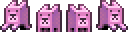
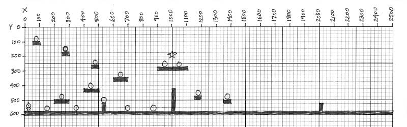

# Steps 6 - 10

## Step 6: Add Enemy and Health Bar

This game will feature a group of cats as an "enemy". Cats are normally great companions, but these cats don't want to be your friend. If the player touches a cat, the player's health will be reduced.

### Add Group for Cats

Declare a global variable named:

* `catGroup` \(will contain all the cat objects\)

In your `preload()` function, load the spritesheet for the cats:

* Load **assets/images/cat.png** as a spritesheet. Use `'cat'` as the asset key. The image contains 4 animation frames in a single row. The entire image is 128 pixels in width and 32 pixels in height. Use this information to determine the width and height of each frame.

  

In your `create()` function, add code to do the following \(**after** the code that adds the coins, but **before** the code that adds the player sprite\):

* Add `catGroup` to the game
* Enable physics for all members of `catGroup`

### Add Cats to Group using For Loop

Rather than placing the cats at specific locations, we're just going to space the cats evenly across the top of the game world, give them a random velocity, and let them drop down onto the platforms.

An easy way to do this is to just use a `for` loop \(similar to how you added the coins but without using JSON data for the positions\).

Add this code to your `create()` function \(after the command that enabled physics for `catGroup`\):

```javascript
    for (var i = 0; i < 25; i++) {
        var cat = catGroup.create(i * 200 + 100, 0, 'cat');

    }
```

This `for` loop will create 25 cats in the `catGroup`. There is some missing code that you'll add in a bit.

The x-position for each cat will be calculated as: `i * 200 + 100`. This will place the cats 200 pixels apart, with the first cat positioned at 100:

* The x-position for the first cat \(`i = 0`\) will be 100 because `0 * 200 + 100 = 100`
* The x-position for the next cat \(`i = 1`\) will be 300 because `1 * 200 + 100 = 300`
* The x-position for the next cat \(`i = 2`\) will be 500 because `2 * 200 + 100 = 500`
* The x-position for the next cat \(`i = 3`\) will be 700 because `3 * 200 + 100 = 700`
* and so on...

The y-position for each cat will be `0` \(the top of the game display\).

**Refresh your HTML preview to verify that the 25 cats appear evenly spaced apart along the top of the game.**

### Add Physics Properties and Animation to Cats

Now you'll add the missing code inside the `for` loop to give each cat some physics properties and an animation.

Inside your `for` loop \(after the command that creates the cat in the `catGroup`\), add code to do the following for each `cat`:

* Set the anchor for `cat` to be its center \(`0.5, 0.5`\)
* Set its `body.gravity.y` to `300`
* Set its `body.bounce.x` to `1`
* Set its `body.collideWorldBounds` to `true`
* Add an animation named `'left'` that will play frames 0-1 \(in order\) at 10 frames per second in a loop
* Add an animation named `'right'` that will play frames 2-3 \(in order\) at 10 frames per second in a loop
* Add this code to give each cat a random velocity \(and a 50% chance of having its direction reversed\):

  ```javascript
  cat.body.velocity.x = Math.random() * 50 + 100; // between 100-150
  if (Math.random() < 0.5) cat.body.velocity.x *= -1; // reverse direction
  ```

Next, you need to make sure the cats collide with the platforms and walls, similar to what you did for the player and coins.

In your `update()` function \(after the `collide()` statements for the `player`\), add code to do the following:

* Make `catGroup` and `platformGroup` collide with each other
* Make `catGroup` and `wallGroup` collide with each other

You'll also add some code to make sure each cat plays the correct animation based on its direction of movement \(which will change as the cats bounce off the walls and game boundaries\).

Add this code in your `update()` function \(after the code that added the background parallax\):

```javascript
    // CHECK CAT ANIMATIONS
    catGroup.forEach(function (cat) {
        if (cat.body.velocity.x < 0) cat.animations.play('left');
        else cat.animations.play('right');
    });
```

This function will check the velocity of each cat in the `catGroup`. If the cat's velocity is less than zero, that means the cat is moving to the left. Otherwise, the cat is moving to the right.

**Refresh your HTML preview to verify that the cats fall down. The cats should move at different speeds and should collide with the platforms and walls. If a cat collides with a wall or a game boundary, the cat should reverse direction. The cats should play the correct animation as they move and change direction.**

### Add Patrol Behavior for Cats on Platforms

For this game, we're going to add a simple AI \(artificial intelligence\) for the cats: if a cat is on a platform, then it will patrol back and forth on the platform \(instead of running off the edge\).

We'll add this behavior using a custom function that will run whenever a cat is on top of a platform \(i.e., colliding with the platform\).

Modify your existing `collide()` command for the `catGroup` and `platformGroup`:

* When a collision occurs, it should call a custom function named `patrolPlatform`.

Add this code after your `update()` function to create the custom function :

```javascript
function patrolPlatform(enemy, platform) {
    // if enemy about to go over right or left edge of platform
    if (enemy.body.velocity.x > 0 && enemy.right > platform.right
    || enemy.body.velocity.x < 0 && enemy.left < platform.left) {
        enemy.body.velocity.x *= -1; // reverse direction
    }
}
```

The `patrolPlatform()` function checks for two possible conditions:

* The `enemy` is moving to the right \(`velocity.x > 0`\) AND the right edge of the `enemy` sprite is hanging over the right edge of the `platform` sprite

  OR

* The `enemy` is moving to the left \(`velocity.x < 0`\) AND the left edge of the `enemy` sprite is hanging over the left edge of the `platform` sprite

If either of those conditions is true, then the function simply reverses the direction of the `enemy` by multiplying its `velocity.x` by `-1`. For example, if the `velocity.x` was -125 \(moving to the left\), it would become 125 \(moving to the right\).

**Refresh your HTML preview to verify that any cats landing on a platform will patrol back and forth on the platform. Even cats on the ground \(which is also a platform\) should patrol back and forth.**

### Add Player Health Bar

If the player's character touches a cat, the player will have its health reduced slightly. So let's first add a health bar for the player.

Declare a global variable named:

* `healthBar` \(green bar that will be scaled to represent health value\)

In your `preload()` function, load these images for the health bar:

* Load **assets/images/bar-red.png** with `'red-bar'` as its asset key
* Load **assets/images/bar-green.png** with `'green-bar'` as its asset key
* Load **assets/images/bar-outline.png** with `'bar-outline'` as its asset key

In your `create()` function \(after the code that adds the `player` sprite\), add commands to do the following:

* Set the `health` property for the `player` to `100`
* Set the `maxHealth` property for the `player` to `100`

In your `create()` function \(after the code that adds `scoreText`\), add code to do the following:

* Declare a local variable named `healthText` that adds text to the game with these properties:
  * To declare a local variable, just list `var` in front of the variable name
  * The text should be positioned at: `325, 20`
  * The text should display: `'Health'`
  * The text should use this style: `{ fontSize: '20px', fill: '#222222' }`
* Make `healthText` stay fixed to the camera \(so it doesn't move when the game world scrolls\)
* Declare local variables named `barBackground` and `barOutline`, like this:

  `var barBackground, barOutline;`

* Add an image assigned to `barBackground` at position `400, 20` using the `'red-bar'` asset
* Make `barBackground` stay fixed to the camera
* Add an image assigned to `healthBar` at position `400, 20` using the `'green-bar'` asset
* Make `healthBar` stay fixed to the camera
* Add an image assigned to `barOutline` at position `400, 20` using the `'bar-outline'` asset
* Make `barOutline` stay fixed to the camera

**Refresh your HTML preview to verify that the health bar appears at the top center of the game. The bar should be green with a dark gray outline. \(Remember that the red bar background is currently hidden because it is covered by the green bar.\)**

### Add Cat Sound

Let's add a sound for the cats that will play whenever the player touches a cat.

Declare a global variable named:

* `catSound`

In your `preload()` function, load the audio file for the sound:

* Load **assets/sounds/meow.wav** with `'cat-sound'` as its asset key

In your `create()` function, add the sound to the game:

* Add `catSound` to the game as audio using the `'cat-sound'` asset with a volume of `0.2`

### Add Custom Function When Player Touches Cat

Now let's detect when the player touches a cat. Besides reducing the player's health, we'll play the cat sound and also make the cat jump away from the player.

Rather than using a `collide()` method to detect when the player touches a cat, we'll use an `overlap()` method. They both detect when objects touch. However, `collide()` also allows moving objects to transfer momentum, so if we used a `collide()` method, then the cats would speed up every time they touch the player.

In your `update()` function \(**after** the `collide()` method between the `catGroup` and `platformGroup`\), add the following:

* Add a `overlap()` method between `player` and `catGroup` \(list in this order\) that will call a custom function named `touchCat`

After your `update()` function, add the following:

* Add a new custom function named `touchCat()`. Inside the parentheses `( )`, list `player, cat` as parameters.

Inside the curly braces `{ }` of your `touchCat()` function, add code to do the following:

* Reverse the direction of the `cat` by multiplying its `body.velocity.x` by `-1`
* Make the `cat` jump by setting its `body.velocity.y` to `-150`
* Move the cat away from the player by changing its x-position with this code:

  ```javascript
  if (player.x < cat.x) cat.x += 20;
  else cat.x -= 20;
  ```

* Play the `catSound`
* Reduce the `player` health by `5` using the `damage()` method
* Scale the width of the `healthBar` to be: `player.health / player.maxHealth` \(keep the scale for the height as `1`\).

If you need help with the code for scaling the health bar, look back at Step 11 of Practice 2.

**Refresh your HTML preview to verify that the player's health bar is reduced when the player touches one of the cats. The cat should reverse direction and jump away from the player. You should hear the cat sound play when this happens.**

### Reset Player to Start When Killed

If the player runs out of health, Phaser will automatically `kill()` the sprite. When that happens, let's reset the player's character back at the beginning of the level.

In your `create()` function \(after the code that adds the `player`\), add code to do the following:

* Add an `onKilled` event for the `player` that will run a function.

If you need help with the code for adding an `onKilled` event, look back at Step 6 of Practice 2.

Inside the curly braces `{ }` of the `onKilled` event function, add commands to do the following:

* Reset the `player` back to position `25, 300` with a health value of `100` using this command:

  ```javascript
  player.reset(25, 300, 100);
  ```

* Scale the width of the `healthBar`

**Refresh your HTML preview to verify that when the character's health runs out, the player is reset back to the start of the level with full health.**

## Step 7: Add Power-Up with Timer

Next we're going to add some "power-up" objects to the game that will temporarily boost the player's running and jumping speeds. We'll use a star as the power-up object. We'll set a timer to control how long the power-up works.

### Add Power-Up Group

Declare a global variable named:

* `powerUpGroup` \(will contain all the power-up objects\)
* `powerUpActive` and assign it an initial value of `false`

In your `preload()` function, load this image for the power-up:

* Load **assets/images/star.png** with `'star'` as its asset key

  

In your `create()` function \(after the code that adds the `coinGroup`\), add commands to do the following:

* Add `powerUpGroup` to the game as a group
* Enable physics for the members of `powerUpGroup`
* Create a member of `powerUpGroup` at position `1000, 200` using the `'star'` asset
* Create a member of `powerUpGroup` at position `3000, 400` using the `'star'` asset
* Set all the members of `powerUpGroup` to have their `'anchor.set'` property set to a value of `0.5`

**Refresh your HTML preview to verify that the star objects appear in the game at correct positions. They should be floating in mid-air \(since you didn't add any gravity to them\).**

### Add Message Text

When the player collects a star, we'll display a message on the screen while the power boost is active \(and then hide the message after the power-up timer has run out\).

So let's add a blank text object to the game that we can use later to display a message to the player. We'll also use this same text object for a different message in Step 8.

Declare a global variable named:

* `messageText` \(will be used to display text\)

In your `create()` function, add code to the following:

* Add `messageText` to the game as text with these properties:
  * Position the text at: `500, 100`
  * Have the text display nothing for now \(use empty quotes\): `''`
  * Style the text using: `{ fontSize: '48px' }`
* Set the text anchor position to be its center: `(0.5)`
* Set a shadow for the text using these properties: `(2, 2, '#000000', 2)`
* Make the text stay fixed to the camera
* Hide the text by setting its `visible` property to `false`

### Add Custom Function With Timer When Player Collects Power-Up

Now let's detect when the player touches a star. This is when we'll start the power boost. We'll display a message on the screen, change the player's character to a green color, and start a 10-second timer. While the power-up is active, we'll increase the player's running and jumping speeds. When the timer runs out, we'll change everything back to normal.

In your `update()` function \(**after** the `collide()` method between the `player` and `coinGroup`\), add the following:

* Add a `collide()` method between `player` and `powerUpGroup` \(list in this order\) that will call a custom function named `collectPowerUp`

After your `update()` function, add the following:

* Add a new custom function named `collectPowerUp()`. Inside the parentheses `( )`, list `player, powerUp` as parameters.

Inside the curly braces `{ }` of your `collectPowerUp()` function, add code to do the following:

* Remove the `powerUp` object \(the star\) using the `kill()` method
* Change the value of `powerUpActive` to `true`
* Set the `text` property of `messageText` to display `'Power Boost'`
* Set the `fill` color for `messageText` to be green using: `'#00ff00'`
* Make `messageText` visible
* Change the `player` sprite to a green color by setting its `tint` property to `0x00ff00`
* Use this command to start a timer event that will run a custom function named `stopPowerUp` after 10 seconds have elapsed:

  ```javascript
  game.time.events.add(Phaser.Timer.SECOND * 10, stopPowerUp, this);
  ```

Before we forget, let's add this custom function that will stop the power-up.

Add another new custom function named `stopPowerUp()`. Inside the curly braces `{ }` of this function, add code to do the following:

* Change `powerUpActive` to `false`
* Hide `messageText` by changing its `visible` property
* Remove the green color from the `player` by setting its `tint` to `0xffffff` \(represents no tint\)

We haven't added the code to change the player's speed yet, but let's test out what we've added so far.

**Refresh your HTML preview to verify that the "Power Boost" message appears when the player collects a power-up star. The player should turn a green tint. The player's speed will still be normal \(because we haven't added that code yet\). After 10 seconds, the message should disappear and the player should turn back to normal.**

### Increase Player's Speed While Power-Up is Active

Now we're ready to add the code to increase the player's running and jumping speeds while the power-up is active.

We'll use the value of `powerUpActive` to detect when the power-up is supposed to be active. If `powerUpActive` is `true`, we'll use a larger value for the velocity that makes the player run or jump. Let's increase the velocity by 50% \(e.g., if the normal running speed is `200`, we'll boost to `300`\).

So we'll modify the existing code in the `update()` function that detect the player's input. Inside those if-else statements , we'll add local variables to represent the normal values for `runSpeed` and `jumpSpeed`. If `powerUpActive` is `true`, we'll increase the values of these variables.

Modify your existing if-else statements in the `update()` function that check the player input, so the code looks like this:

```javascript
    // CHECK PLAYER INPUT
    if (arrowKey.right.isDown) {
        var runSpeed = 200;
        if (powerUpActive) runSpeed = 300;
        player.body.velocity.x = runSpeed;
        player.animations.play('right');
    }
    else if (arrowKey.left.isDown) {
        var runSpeed = -200;
        if (powerUpActive) runSpeed = -300;
        player.body.velocity.x = runSpeed;
        player.animations.play('left');
    }
    else {
        player.body.velocity.x = 0;
        player.animations.stop();
        player.frame = 4;
    }

    if (arrowKey.up.justDown && player.body.touching.down) {
        var jumpSpeed = -300;
        if (powerUpActive) jumpSpeed = -450;
        player.body.velocity.y = jumpSpeed;
    }
```

**Refresh your HTML preview to verify that the player's running and jumping speeds are boosted while the power-up is active.**

## Step 8: Add Countdown Timer for Game Over

Next let's add to the challenge of the game by adding a countdown timer for the player to complete the level. Instead of displaying the time as text, we'll add a timer bar that decreases to show the amount of time remaining. Let's give the player 2 minutes \(120 seconds\) to complete the level.

### Add Time Bar

Declare a global variable named:

* `timeBar` \(yellow bar that will be scaled to represent amount of time remnaining\)
* `timeUp` and assign it an initial value of `false`
* `timeLimit` and assign it an initial value of `120` \(which represents the number of seconds\)

In your `preload()` function, load these images for the health bar:

* Load **assets/images/bar-black.png** with `'black-bar'` as its asset key
* Load **assets/images/bar-yellow.png** with `'yellow-bar'` as its asset key

In your `create()` function \(after the code that adds `barBackground`, `healthBar`, and `barOutline`\), add code to do the following:

* Declare a local variable named `timeText` that adds text to the game with these properties:
  * To declare a local variable, just list `var` in front of the variable name
  * The text should be positioned at: `720, 20`
  * The text should display: `'Time'`
  * The text should use this style: `{ fontSize: '20px', fill: '#222222' }`
* Make `timeText` stay fixed to the camera
* Add an image assigned to `barBackground` at position `780, 20` using the `'black-bar'` asset
* Make `'barBackground` stay fixed to the camera
* Add an image assigned to `timeBar` at position `780, 20` using the `'yellow-bar'` asset
* Make `'timeBar` stay fixed to the camera
* Add an image assigned to `barOutline` at position `780, 20` using the `'bar-outline'` asset
* Make `'barOutline` stay fixed to the camera

**Refresh your HTML preview to verify that the time bar appears at the top center of the game. The bar should be yellow with a dark gray outline. \(The black bar background is currently hidden because it is covered by the yellow bar.\)**

### Add Custom Function to Update Time Bar

Now let's add a custom function to determine how much time has elapsed in the game and use that to update the time bar to show how much time is remaining.

Luckily, Phaser has a built-in method called `game.time.totalElapsedSeconds()` to calculate how much time \(in seconds\) has elapsed since the game started.

So we can just subtract the game's elapsed time from the `timeLimit` to determine how much time is left over. We can then use this result to scale the `timeBar`.

In your `update()` function, add this as the first line of code inside the curly braces \(before any of the `collide()` methods\):

```javascript
displayTimeLeft();
```

This will run a custom function named `displayTimeLeft()` as the first step every time the `update()` loop occurs.

After your `update()` function, add this code to create the custom function:

```javascript
function displayTimeLeft() {
    var time = game.time.totalElapsedSeconds();
    var timeLeft = timeLimit - time;

    if (timeLeft < 0) {
        timeLeft = 0;
        timeUp = true;
    }

    timeBar.scale.setTo(timeLeft / timeLimit, 1);
}
```

Notice that we had to detect if the value of `timeLeft` was less than zero. If so, we set to be exactly zero. Otherwise, if we didn't do that, the `timeBar` would scale to show negative `timeLeft` \(the yellow bar would actually start expanding outside of its outline\). We also use this to detect when to set the value of `timeUp` to `true`.

Also notice that you scale the `timeBar` similar to how you scale the `healthBar`. For the `timeBar`, you divide the `timeLeft` by the `timeLimit` to get the proportion of time remaining. For example, if only 30 seconds remain out of a 120-second time limit, then the `timeBar` should be scaled to 0.25 of its original width \(30 / 120 = 0.25\).

**Refresh your HTML preview to verify that the yellow time bar decreases in width to show the time remaining in the game until it reaches zero \(time bar will be completely black\).**

### Add Custom Function for Game Over When Time Runs Out

Now let's add a "game over" function that will run when the time limit for the game is over. We can use the value of `timeUp` to detect when this has occurred.

When `timeUp` is `true`, we want to display a game over message to the player, and make the `player` sprite disappear \(so the game is effectively over\).

Modify the first line of code inside your `update()` function, so it looks like this instead:

```javascript
    if (timeUp) gameOver();
    else displayTimeLeft();
```

Now if `timeUp` is `true`, it will run the custom function named `gameOver()`. Otherwise \(when `timeUp` is `false`\), it will run the custom function `displayTimeLeft()`.

Next you need to add the `gameOver()` function.

After your `update()` function, add a new custom function named `gameOver()`. Inside the curly braces `{ }` of this function, add code to do the following:

* Set the `text` property of `messageText` to display `'Time Up'`
* Set the `fill` color for `messageText` to be red using: `'#ff0000'`
* Make `messageText` visible
* Make the `player` sprite disappear by setting its `exists` property to `false`

Notice that instead of using the `kill()` method to remove the `player` sprite, we simply set its `exists` property to `false`. The reason for this is because we previously added an `onKilled` event for the `player` \(when its health runs out\) that resets the sprite back to the beginning of the game with full health. However, when the time limit runs out, we want the game to be completely over, so that's why we used the `exists` property instead of the `kill()` method. Both of them remove the player, but we want to avoid triggering the `onKilled` event in this situation.

**Refresh your HTML preview to verify that "Time Up" message appears and the player disappears when time runs out.**

## Step 9: Create Your Own Design for Rest of Level

What you’ve made so far is a partial game. Now it's up to you to design and build the rest of the level.

In this step, you’ll create of a map of your design for the complete level. In Steps 10-15, you’ll implement your design and playtest it.

Use [this graph paper](https://drive.google.com/open?id=0B8MTiM_lFG9TN0taLXdUdEF5OVk) to create a scale map of the complete game level showing the size and location of all the objects \(including new objects you’ll add in Steps 10-12\), such as platforms, walls, coins, etc.

* A recommended scale for the graph is to have each square represent either 20 or 25 pixels \(choose one\). Use the same scale for both the horizontal and vertical axes of the graph.
* You will probably need to split up your level map into multiple sections \(either on the same graph sheet or across multiple sheets\).
* Mark and label your horizontal and vertical scales for your game world on the graph. Unless you've changed it, your game world is 5000 pixels in width and 600 pixels in height.
  * The **x-positions** start with **0 as the left edge** of the game world, and they increase as you move towards the right edge.
  * The **y-positions** start with **0 as the top edge** of the game world, and they increase as you move towards the bottom edge.
* **OPTIONAL:** If desired, you can reduce the width of the game world from 5000 pixels to a smaller size \(but make it at least 3000 pixels wide\). The existing platforms are placed within the first 1500 pixels of the game world.
* Include the size and locations of the existing platforms, walls, and other objects \(coins, etc.\) in your level map.  \(If desired, you can change the size and/or locations of these existing objects.\)
  * For the platforms and walls, the position at which they were created represents their **top-left** corner \(since we didn't change the default anchor position for these objects\). 
  * As a reminder, all the platforms are 25 pixels in height. The width of the platforms range from 50 pixels to 500 pixels \(depending on which platform asset is used\).
  * As a reminder, all the walls are 25 pixels in width. The height of the walls range from 50 pixels to 250 pixels \(depending on which wall asset is used\).
  * You do not necessarily need to include the locations of **moving** objects \(cats, etc.\) unless it is helpful to you. For example, if you want the player to encounter a "boss" enemy at a certain location, it may help to include that on the map.
* Be sure to include the size and locations of the new objects that you plan to add in Steps 10-12.



Partial scale map of level \(first 2500 pixels of width\) showing starting position of player, size and location of existing platforms and walls, locations of coins \(after falling\), and location of power-up \(star\). Next step would be to add new objects, and create rest of map.

**RECOMMENDED:** Preview the instructions in Steps 10-15 to see more details about what you’ll need to do to complete this practice. Here’s a brief summary:

* In **Step 10**, you’ll add more platforms \(and walls\) throughout the rest of the level.  You need to add at least 10 more platforms. You can modify the size and/or location of any existing platforms or walls \(but you don’t have to\).
* In **Step 11**, you’ll add a new obstacle that hinders the player in some way, such as a spike, new enemy, etc. You can add an individual obstacle or a group of obstacles.
* In **Step 12**, you’ll add a new resource that helps the player in some way, such as a diamond, health pack, weapon, etc. You can add an individual resource or a group of resources.  You'll also add more coins for the player to collect.
* In **Step 13**, you’ll add more sound effects to the game. You’ll use existing sounds from Practice 1 to play a sound effect when the player collects a coin and when the player collects a power-up. Optionally, you create your own sound effects using a web app called [ChipTone](http://sfbgames.com/chiptone/).
* In **Step 14**, you’ll have the option to create an animated sprite using a web app called [Piskel](http://www.piskelapp.com/).
* In **Step 15**, you’ll have someone else playtest your game to provide feedback.

## Step 10: Add Rest of Platforms and Walls

Add additional platforms \(and walls\) throughout the rest of the level:

* Add at least 10 more platforms to the game. You decide the size and location of the additional platforms \(and any additional walls\).
* **OPTIONAL:** You can change the size and/or location of any existing platforms or walls.
* **OPTIONAL:** If desired, you can reduce the width of the game world from 5000 pixels to a smaller size \(at least 3000 pixels\). Refer back to Step 3 to see how to make this change in your code.
* **OPTIONAL:** If desired, you can also reduce the width of the game display from 1000 pixels back to 800 pixels. Refer back to Step 3 for help with the code. However, if you do this, be sure to also:
  * Change the width of `#my-game` in your CSS file to `800px`
  * Adjust the locations of the health bar and time bar to fit within the narrower game display.

**IMPORTANT:** After adding the rest of the platforms \(and walls\), playtest your game to ensure the `player` can navigate through the platforms and walls to complete the level. If it's not possible to navigate the level, you'll need to do one or both of the following \(and then retest your game\):

* Modify the size and/or location of specific platforms \(or walls\).

  **AND / OR**

* Modify certain properties of the `player`, such as its running speed, jumping speed, gravity, etc.

## Steps 11-15 continue on next page

