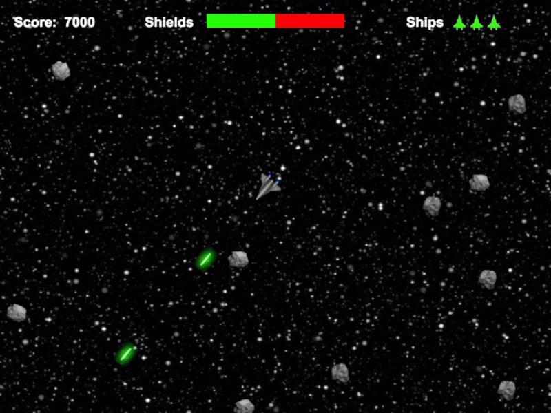

# Top-Down Game

In this second practice, you're going to create a top-down game that shows an overhead view of the player. It will be a space shooter game, similar to [Asteroids](http://2600online.com/asteroids.php). This game will feature a nice balance of player skill, random chance, and increasing challenge. It will reinforce the basic concepts of using Phaser to create a game, plus show you some advanced features in Phaser.

Our game will be an update to the classic Asteroids that we'll call **Asteroids 2084**. Here's its premise:

> The year is 2084. The Mars colony is running out of water and needs to reach the icy moons orbiting Jupiter. You're a spaceship pilot sent on a scouting mission to clear a path to Jupiter through the asteroid belt. Asteroids threaten to collide with your ship from all directions. Your only option is to evade and destroy the asteroids before they destroy you.

In this practice, all the game assets \(i.e., images and sounds\) and **some** of the game code will be provided. Focus on two things: \(1\) becoming familiar with the new Phaser commands that will be introduced, and \(2\) applying the Phaser commands you've already seen.

**PREVIEW VIDEO:** [Demo of Asteroids 2084](https://drive.google.com/open?id=0B8MTiM_lFG9TVmwzX25HcFhkNW8)

## PREP STEPS

1. Complete the [Quick Setup](../quick-setup.md) for a new game.
2. Download this [assets.zip](https://drive.google.com/open?id=0B8MTiM_lFG9Tb0stWDkwQ21jQlk) file, and extract the file contents, which will be a folder named **assets** that has two subfolders containing 12 images and 7 sounds. \(To extract the file on a Windows computer, right-click on the downloaded zip file, and select _Extract All_. On a Mac, double-click on the downloaded zip file.\)
3. Replace your new game assets folder with this **assets** folder with all the included files in the subfolders.
4. Test your Phaser game template by previewing the HTML file online. If everything's ready to go, you should see a **solid black box** \(your blank game canvas\) on your webpage.

## CODING STEPS

This  game will be coded in 15 steps, with the last step being an extra credit challenge. Some steps will involve coding that's similar to things you did previously. However, most of the steps will also introduce and explain new Phaser features.

The steps are outlined below.

* Step 1: Add Player Sprite 
* Step 2: Add Player Input 
* Step 3: Add Physics and Player Movement 
* Step 4: Add Tilesprite Background 
* Step 5: Add Asteroids Group 
* Step 6: Add Player Collision with Asteroids 
* Step 7: Add Player Weapon 
* Step 8: Add Particle Effect to Asteroids 
* Step 9: Add Asteroid Spawning 
* Step 10: Add Score 
* Step 11: Add Player Shields \(Health Bar\) 
* Step 12: Add Player Lives 
* Step 13: Add Extra Life Reward 
* Step 14: Add Game Start and Game Over 
* Step 15: Add Enemy Ship \(Extra Credit\)

