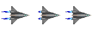
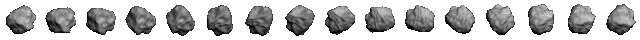

# Steps 1 - 5

## Step 1: Add Player Sprite

Add a sprite for the player. As a reminder, adding a sprite to the game involves 3 steps:

* Declare a global variable for the sprite.
* Load its spritesheet into memory in the `preload()` function.
* Add the sprite to the game in the `create()` function.

Use `player` as the name of the global variable for the sprite.

Use **assets/images/spaceship.png** for the spritesheet image. It contains 3 animation frames that are each 64 pixels in width and 64 pixels in height. Assign an asset key name to the spritesheet, such as `ship`.



Add the `player` sprite to the center of the game world, and set the sprite's anchor to its center.

For help with the code for sprites, you can refer back to Step 4 of Practice 1 \(or look at your Practice 1 game code\).

**Refresh your HTML preview to verify that the player sprite appears in the center of the game.**

## Step 2: Add Player Input

This game will played using keyboard inputs. Most keyboard-based games use either the WASD keys or the arrow keys to move the player's character.

Your game will use the following keys to control the player's spaceship:

* **left arrow** key will rotate the ship counter-clockwise
* **right arrow** key will rotate the ship clockwise
* **up arrow** key will move the ship forward
* **spacebar** key will fire the ship's laser

Since it is common for games to use the arrow keys for input, Phaser has a command to add all four arrow keys as inputs \(rather than having to add them individually\). Phaser refers to the arrow keys as cursor keys \(since many computer programs use the arrow keys to move the cursor\).

Create a global variable named `arrowKey`.

Add this Phaser command in the `create()` function:

```javascript
arrowKey = game.input.keyboard.createCursorKeys();
```

This command will make all 4 arrow keys \(left, right, up, down\) into inputs assigned to the `arrowKey` variable. The individual keys are identified using the properties `left`, `right`, `up`, and `down`. So in your game, these inputs will be:

* `arrowKey.left` \(used to rotate ship counter-clockwise\)
* `arrowKey.right` \(used to rotate ship clockwise\)
* `arrowKey.up` \(used to move ship forward\)
* `arrowKey.down` \(not used in game\)

Create a global variable named `fireKey`.

Add a Phaser command in the `create()` function to add the spacebar key as an input assigned to the `fireKey` variable.

For help with the code to add an individual key as input, you can refer back to Step 5 of Practice 1 \(or look at your Practice 1 game code\).

## Step 3: Add Physics and Player Movement

Let's make the player's spaceship move in response to the player's inputs. For that, we're going to need to use physics.

Many games features simulated physics. Objects in the games can move and accelerate. The objects can be affected by gravity and friction. Objects can collide and bounce off each other — and will respond differently based on their masses.

The cool thing about simulated physics is that you can make the game world behave however you want: You can change gravity so that objects will "fall up" instead of falling down. You can selectively apply gravity only to certain objects — or eliminate gravity entirely. You get to decide which physics properties to use and how to use them.

Phaser has several physics systems to choose from. We're going to use the **Arcade Physics** system, which is a good choice for most games. Arcade Physics has lots of useful physics properties and methods, plus support for weapons \(i.e., the ability to shoot or throw objects such as bullets, lasers, arrows, fireballs, etc.\). It's more simplistic than the other physics systems, but it runs much faster.

First, you have to "start" the physics system by including a Phaser command at the beginning of your `create()` function. Then you have to "enable" physics for specific objects in your game. Not every object in the game actually needs to use physics, so you only enable it on the ones that do.

Start the Arcade Physics system by adding this Phaser command as the first line of code in the `create()` function:

```javascript
game.physics.startSystem(Phaser.Physics.ARCADE);
```

Enable physics on the `player` sprite by adding this Phaser command in the `create()` function \(after the command that set the anchor for the sprite\):

```javascript
game.physics.arcade.enable(player);
```

This will create an Arcade Physics `body` object associated with the `player` sprite. So let's add a couple of physics properties to the `player.body`.

Add this Phaser code in the `create()` function \(after the "enable" physics command for the sprite\):

```javascript
    player.body.maxVelocity.set(400);
    player.body.drag.set(20);
```

* The first line simply sets a limit on the velocity \(speed\) of the sprite. In Phaser, velocity is measured in pixels per second.
* The second line adds a small amount of drag \(friction\) as the sprite moves. In reality, a spaceship in outer space would experience almost zero drag \(because there is no air to cause drag\), but since our game screen is relatively small, we'll add a small amount of drag so the spaceship doesn't drift off-screen with every forward movement.

Another thing to notice is that we did not set a gravity value for the `player.body` because our game is set in space far from any planets or stars that would create a strong gravity field. Instead, we just want the spaceship to float along, affected only by its engines \(and the small amount of drag that we added\). In your next practice game, we'll start using gravity.

Let's add code to rotate and move the `player` spaceship based on the arrow key inputs.

In Phaser, there are two properties for a sprite's rotation:

* `angle` can be used to get or set the angle of rotation of the sprite, measured in degrees
* `rotation` can be used to get or set the angle of rotation of the sprite, measured in radians \(2π radians = 360°\)

Both `angle` and `rotation` do the same thing — they just use different units of measurement. Either can be used to get the current value of the sprite's angle of rotation. Either can be used to set the sprite to a specific angle of rotation.

Add this Phaser command in the `create()` function \(as part of the commands after adding the sprite\):

```javascript
    player.angle = -90;
```

**Refresh your HTML preview to verify that the player sprite is now pointed up, instead of to the right.**

Setting the `angle` to a negative value \(up to -180\) will rotate the sprite counter-clockwise from its original orientation. Setting the `angle` to a positive value \(up to 180\) will rotate it clockwise from its original orientation. However, it instantly switches the rotation to a specific angle.

Instead, what we want is to make the `player` sprite turn in a continuous motion, when the player presses the left or right arrow keys.

There are a couple of Arcade Physics properties that will allow you to turn \(rotate\) a sprite's `body` in a continuous motion:

* `body.angularVelocity` can be used to get or set the speed of sprite's rotation \(measured in pixels per second\) — negative values = counter-clockwise rotational speed, positive values = clockwise rotational speed
* `body.angularAcceleration` can be used to get or set the acceleration of the sprite's rotation \(measured in pixels per second squared\) — negative values = decrease the rotational speed, positive values = increase the rotational speed

We're going to use `body.angularVelocity`, so the spaceship will rotate at a constant speed:

* If the **left arrow** key is pressed, we'll turn the sprite counter-clockwise at a speed of 200 pixels per second.
* Otherwise, if the **right arrow** key is pressed, we'll turn the sprite clockwise at a speed of 200 pixels per second.
* Otherwise, if **neither** the left nor right arrow key is pressed, we'll stop turning the sprite by setting the speed to 0.

To move the `player` sprite forward, there is an Arcade Physics method \(i.e., function\) called `accelerationFromRotation()` that will allow us to accelerate a sprite's body in the direction of its current angle of rotation:

* If the **up arrow** key is pressed, we'll move the `player` sprite forward by accelerating the sprite at 200 pixels per second squared in the direction of its current rotation.
* Otherwise, if the up arrow key is **not** pressed, we'll stop accelerating the `player` sprite by setting the acceleration to 0. The sprite will stop speeding up, but it will continue to drift forward at its current speed — only being slowed down by the drag that we applied to the `player` sprite's body \(or if the player turns the ship around and starts accelerating in the opposite direction\).

Add this code in the `update()` function to check the inputs and move the spaceship:

```javascript
    if (arrowKey.left.isDown) {
        // rotate player counter-clockwise (negative value)
        player.body.angularVelocity = -200;
    }
    else if (arrowKey.right.isDown) {
        // rotate player clockwise (positive value)
        player.body.angularVelocity = 200;
    }
    else {
        // stop rotating player
        player.body.angularVelocity = 0;
    }

    if (arrowKey.up.isDown) {
        // accelerate player forward
        game.physics.arcade.accelerationFromRotation(player.rotation, 200, player.body.acceleration);
    }
    else {
        // stop accelerating player
        player.body.acceleration.set(0);
    }
```

**Refresh your HTML preview to verify that you can rotate and fly the spaceship using the arrow keys.**

You probably discovered that you can actually fly the spaceship out of the game display. If you fly off-screen, you can turn around and fly back into the game display \(but it can be a little tricky to do when you can't see where the ship is pointed\).

We want to keep the spaceship within the game world boundaries.

Add this Phaser command in the `create()` function \(to go along with your other `player.body` properties\):

```javascript
player.body.collideWorldBounds = true;
```

**Refresh your HTML preview to verify that the spaceship will stay within the game world boundaries as you fly around.**

Next let's add an animation and sound effect to the spaceship to make the flying feel more realistic.

### Player Animation

Remember that the `player` spritesheet has 3 animation frames:


Add this Phaser command in the `create()` function \(somewhere after adding the `player` sprite\):

```javascript
player.animations.add('moving', [0, 1, 2], 10, true);
```

As you can see, this command will add an animation for the `player` sprite. Let's examine the code inside the parentheses to understand how it works:

* `'moving'` assigns a key name to the animation. It is similar to an asset key name or variable name. You decide what name to use, as long as it is a unique name.
* `[0, 1, 2]` is an array listing the spritesheet frame numbers to use \(in order\) for the animation. In our case, we're using all 3 frames \(0-2\).  In other cases, a spritesheet might contain frames for different animations, so you only list the specific frames needed for each animation.
* `10` represents the frame rate that will be used for the animation, in frames per second. Depending on the animation, you might change this number to make it play faster or slower.
* `true` indicates that this animation should play repeatedly in a loop. If you didn't want the animation to loop, then you can list `false`.

Similar to how sounds work in Phaser, the animation won't actually play until you use a command telling it to start playing.

Add this Phaser command in the `update()` function, so that the animation will play when the up arrow key is pressed:

```javascript
player.animations.play('moving');
```

Add this Phaser command in the `update()` function, so that the animation will stop when the up arrow key is not pressed:

```javascript
player.animations.stop();
player.frame = 1;
```

This command stops the animation, and then sets the `player` sprite to display frame number 1 \(the second frame\), which has the smallest engine exhaust flames \(to make it seem like the spaceship engine is "idling"\).

**Refresh your HTML preview to verify that the animation plays as you move the spaceship forward and stops when you release the up arrow key.**

### Engine Sound Effect

Now let's add a sound effect for the spaceship's engines.

As a reminder, adding a sound to the game involves 3 steps:

* Declare a global variable for the sound.
* Load the sound into memory in the `preload()` function.
* Add the sound to the game in the `create()` function.

Use `engineSound` as the name of the global variable for the sound.

Use **assets/sounds/engine.mp3** for the sound file. Assign a unique asset key name to the sound, such as `engine`.

Add `engineSound` to the game with a volume of `0.3`. Also, set this sound to loop repeatedly when it plays.

Let's have `engineSound` play from the very beginning of the game. To do this, add the command to play the sound in the `create()` function \(after setting the sound to loop\).

For help with the code for sounds, you can refer back to Step 6 of Practice 1 \(or look at your Practice 1 game code\).

Add this Phaser command in the `update()` function to make the sound louder when the up arrow key is pressed:

```javascript
engineSound.volume = 1;
```

Then add a similar command in the `update()` function to turn this sound back to normal \(`0.3`\) when the up arrow key is not pressed.

**Refresh your HTML preview to verify that the engine sound plays continuously but gets louder when you move the spaceship forward.**

## Step 4: Add Tilesprite Background

Now that you've got a spaceship that can fly around realistically, let's add a realistic background.

Preview the image file called **space-stars.jpg** in your **assets/images** folder. This image is 800 pixels in width and 600 pixels in height, which is exactly the same size as your game display.

You can add an image as a static background for your game. In fact, you can add multiple images to build a more complex background for a game.

In this game, we're going to add this image as a special background called a **tilesprite**. A tilesprite is an image with a repeating texture or pattern. Phaser can move and wrap the tilesprite in the game display to simulate a scrolling background.

Adding a tilesprite to the game involves 3 steps:

* Declare a global variable for the tilesprite.
* Load the tilesprite's image into memory in the `preload()` function.
* Add the tilesprite to the game in the `create()` function.

Add a global variable named `space` for the tilesprite.

Add this Phaser command in your `preload()` function:

```javascript
game.load.image('space', 'assets/images/space-stars.jpg');
```

As you can see, this is similar to commands for loading a spritesheet or sound:

* `'space'` represents an asset key — again, you get to decide the name of the key, as long as each key has a unique name.
* `'assets/images/space-stars.jpg'` represents the folder path and filename of the image to load.

Add this Phaser command in your `create()` function \(before the command that adds the `player` sprite\):

```javascript
space = game.add.tileSprite(0, 0, 800, 600, 'space');
```

Let's explain what's inside the parentheses:

* `0, 0` represent \(in order\) the x and y pixel coordinates for positioning the tilesprite image. This represents the upper-left of the game. This is normally where you want to position background images.
* `800, 600` represent \(in order\) the width and height to use for the tilesprite \(which is also the same width and height that we set for the game display — we want to fill up the entire background\).
* `'space'` is the asset key name of the image to use for the tilesprite.

**Refresh your HTML preview to verify that the space background appears \(but doesn't move yet\).**

**ORDER MATTERS:** As you create your game world, all the visual objects — such as images, sprites, text, etc. — are added to the game display in layers \(meaning they can overlap other objects behind them\). The order in which they are added in the `create()` function determines the stacking of these layers in the game world.

So if you have an image that is supposed to be a background for your game, then that image should be added first in the `create()` function, so it will be the farthest back layer. Each new visual object \(image, sprite, etc.\) that is added in the code will appear in front of the previous layers.

For example, if you add the player's sprite first and then add the tilesprite background, the player's sprite will be hidden behind the tilesprite. Try testing this out in your code.

### Scroll Tilesprite

Now let's make the tilesprite scroll as the spaceship moves. In order to make the scrolling look realistic, we need to do two things: 1. Scroll the tilesprite in the **opposite** direction of the spaceship's movement. So if the spaceship is moving to the right, the space background should scroll to the left. 2. Scroll the tilesprite at a **slower** speed than the speed of the spaceship. Because the space background represents stars that are in the far distance, they should appear to move slower than the spaceship does.

Add this Phaser code in your `update()` function \(after the if-else statements for the player movement\):

```javascript
    // scroll space tilesprite in opposite direction of player velocity
    space.tilePosition.x = space.tilePosition.x - player.body.velocity.x / 40;
    space.tilePosition.y = space.tilePosition.y - player.body.velocity.y / 40;
```

This code changes the position of the tilesprite. As you can see, the x-position and y-position are set independently. You can also see that Phaser breaks down the velocity \(speed\) of the `player.body` into x and y components.

* By **subtracting** the player's velocity \(after dividing it by 40\), we are moving the tilesprite's position in the **opposite** direction.
* By **dividing** the player's velocity by 40, we are making the change in the tilesprite position **smaller** \(so the tilesprite moves **slower** than the spaceship\).  There's nothing magical about 40 — that number happens to produce results that feel right for this particular game when you fly the spaceship. If you don't divide by 40 \(or change 40 to a small number\), the background will scroll too fast. If you change 40 to a large number, the background will scroll too slowly.

**Refresh your HTML preview to verify that the space background appears to scroll in the opposite direction of the spaceship's movement \(which makes the flying seem more realistic\).**

However, you will notice that the tilesprite scrolling will stop when the spaceship collides with the game world boundaries. This is because the "collision" causes the spaceship's velocity to become zero \(which then causes the tilesprite position to stop changing\).

We want our game to feel like the spaceship can keep flying forever, so we want the tilesprite to keep scrolling even if the spaceship is at or near the edge.

### Restrict Player Position to Allow Endless Tilesprite Scrolling

So to fix this, we're going to add some code to keep the spaceship within the game world without using a collision with the game world boundaries. We'll check the position of the spaceship to make sure it never gets any closer than 50 pixels to any boundary \(left, right, top, or bottom\). This will keep the spaceship on-screen but _not_ actually change its velocity in the game's memory. \(_It's a bit of a trick because the spaceship will visually stop moving because we keep resetting its position, but the game will think the spaceship is still moving._\)

This extra 50 pixels will also leave us some "blank" space along the edge of the game to add the game's user interface elements \(such as the score, etc.\).

Add this Phaser code in your `update()` function \(right before the code that scrolls the tilesprite\):

```javascript
    // keep player onscreen (instead of collideWorldBounds)
    // will allow space tilesprite to keep scrolling
    if (player.left <= 50) player.left = 50;
    else if (player.right >= game.world.width - 50) player.right = game.world.width - 50;

    if (player.top <= 50) player.top = 50;
    else if (player.bottom >= game.world.height - 50) player.bottom = game.world.height - 50;
```

As you can see, Phaser has properties to represent the x-position of a sprite's `left` and `right` edges, as well as the y-position of a sprite's `top` and `bottom` edges. We can get or set these properties to check and/or change the sprite's position.

**Refresh your HTML preview to verify that the spaceship will stay within the game world \(inset a bit from the edge\) and the space background will keep scrolling if the ship still has forward velocity.**

As the spaceship's speed and direction change \(due to your flying maneuvers and the ship's drag\), the scrolling of the space background should appear to speed up or slow down accordingly.

## Step 5: Add Asteroids Group

Now it's time to add some asteroids to your game.

Phaser allows you to create a **Group** of game objects, such as sprites, images, text, etc. The objects that you add as members of a group are usually related in some way, such as a group of enemy sprites, a group of platforms or walls, etc.

Typically, the members of a group have many similarities — but they can also have some differences. For example, a group of enemy sprites might use the same spritesheet and move at the same speed, but each enemy sprite is probably in a different location and might be moving in a different direction.

One advantage of using a group is that is makes it easier to perform checks or actions on each member of the group. For example, one line of code could be used to set a property for every member in a group, such as setting the gravity value for each group member. Your code could also quickly loop through each member in a group to check a condition and decide what action to take for each individual member, such as deciding whether each enemy sprite in a group is close enough to the player sprite to fire at it.

Another advantage of using a group is that your code can "recycle" objects in the group \(which helps save memory and make your game run faster\). For example, if you have a group of enemy sprites and one of the enemy sprites is "killed", your game can reuse that sprite later to create another enemy elsewhere in the game.

### Add Group

You're going to create a group of 10 asteroid sprites for your game.

Adding a group to the game usually involves 4 steps:

* Declare a global variable for the group.
* If the group members will use an image or spritesheet, load the image or spritesheet into memory in the `preload()` function.
* Add the group to the game in the `create()` function.
* Add individual members to the group — usually done in the `create()` function \(but can also be done in the `update()` function\).

You can even use different images or spritesheets for the members in a group. For example, you could load and use different spritesheets for different types of enemies in a group. \(You could also create separate groups for each type of enemy — it just depends on your game's design and what makes more sense for coding it.\)

Add a global variable named `asteroidGroup` for the asteroid sprites.

Each asteroid in the group will use the same spritesheet. Preload **assets/images/asteroid.png** for the spritesheet image. It contains 16 animation frames that are each 40 pixels in width and 40 pixels in height. When these frames are played, it will make the asteroid look like it is spinning. Assign an asset key name to the spritesheet, such as `asteroid`.



Add this Phaser command in your `create()` function \(after the code related to the player\):

```javascript
asteroidGroup = game.add.group();
```

Similar to what we did for the `player` sprite, we will need to enable physics on every asteroid sprite that we add to the group. Rather than needing to do this for each individual asteroid, we can use a single line of code to enable physics for the entire group \(even before we add any members to the group\).

Add this Phaser command in the `create()` function \(after the command that added the group\):

```javascript
asteroidGroup.enableBody = true;
```

### Add Members to Group

Now we can start adding members to the group. There are several ways to do this:

* Add each member using separate lines of code for each member.
* Use a `for` loop to quickly add multiple members using the same lines of code.
* Do both: use a `for` loop to add a set of members, and then use separate code to individually add certain members that have very unique properties.

We're going to use a `for` loop to quickly add each of the 10 asteroids to the group. In our game, we want each asteroid to start at a random location at the start of the game. Then we'll also make each asteroid move at a random speed in a random direction.

Add this code in the `create()` function \(after the command that added the group\):

```javascript
    // add asteroids to group
    for (var i = 0; i < 10; i++) {
        // create individual asteroid in group
        var asteroid = asteroidGroup.create(game.world.randomX, game.world.randomY, 'asteroid');
        asteroid.anchor.set(0.5, 0.5);

    }
```

**RESOURCE:** [W3Schools has a JavaScript tutorial on For Loops](https://www.w3schools.com/js/js_loop_for.asp)

### How For Loop Works

A `for` loop contains a set of code within curly braces `{ }` that will be performed for a certain number of times \(_that's how it gets its name_\).

The number of times that the `for` loop repeats is determined by the code in the parentheses `( )` after the word `for`:

* `var i = 0;` sets an initial value for a local variable that will be used as a loop counter. Traditionally, you will see `i` used as the variable name for the loop counter because it stands for the word "iteration" \(which means repetition\).
* `i < 10` sets a condition that is checked at the beginning of each loop — if the condition is true, the loop will occur — meaning the code inside the curly braces `{ }` will be performed. In this particular case, if the value of `i` is less than 10, then another loop will occur.
* `i++` increases the loop counter by 1 at the end of each loop. \(`i++` is shorthand for `i = i + 1`\).

Here's how it would work when the game code runs:

* At the start of the `for` loop, `i` equals 0, and since 0 is less than 10, it will perform a loop — performing the code inside the curly braces.
* At the end of the first loop, `i` will be increased from 0 to 1. Since 1 is still less than 10, it will perform another loop — performing the code inside the curly braces another time.
* At the end of the second loop, `i` will increase to 2. Since 2 is still less than 10, it will perform another loop of the code.
* This process will keep repeating until `i` has increased to 10. At that point, 10 is **not** less than 10 \(_duh, they're equal_\) — so the condition becomes **false**, which causes the `for` loop to stop repeating.  The `for` loop will have repeated itself exactly 10 times.

Check your understanding: If you wanted to create 15 asteroids in the group, what would you change in the code?

Now let's look at the Phaser commands inside the `for` loop curly braces `{ }`:

* The first command creates a new member in the `asteroidGroup` and assigns that member to a local variable named `asteroid` \(_local variables only exist inside a particular loop, statement, or function_\). Inside the parentheses, you indicate \(in order\) the x and y coordinates of the object's location in the game and then the asset key name to use for the object. In this case, each asteroid will get a random x and random y position and will use the `asteroid` spritesheet.
* The second command sets the anchor point for the asteroid's position to be the center of the sprite. This command should be  familiar to you by now.

**RESOURCE:** [W3Schools has a JavaScript tutorial on Variable Scope \(Global vs. Local\)](https://www.w3schools.com/js/js_loop_for.asp)

**Refresh your HTML preview to verify that 10 asteroids appear in random locations in the game. Refresh it a few more times to verify that the asteroids' locations are different every time.**

If you fly the spaceship around, you will see that the asteroids remain fixed in location \(because you haven't added any code to make them move yet\). You'll also discover that the spaceship will fly **behind** the asteroids. This is because we added the asteroid group after adding the player sprite. If you were to switch the order of their code in your `create()` function, the spaceship would fly in front of the asteroids. Let's leave it so that player sprite is added **before** the asteroid group is added.

### Add Asteroid Animations

Let's add two possible animations for each asteroid: either spinning clockwise or spinning counter-clockwise.

Add a Phaser command inside the `for` loop \(after the command that sets the asteroid anchor\) to add an `asteroid` animation named `spin-clock` that will play all 16 frames in order \(list an array from 0-15\) at a frame rate of 16 \(meaning it will play all 16 frames in one second\) and set it to loop.

For help, look at your code from **Step 3** that added an animation for the `player` sprite.

Add another `asteroid` animation named `spin-counter` that lists the 16 frames in reverse order \(from 15 down to 0\). Use the same frame rate \(16\) and set it to loop.

Now that you've added the two possible animations for each asteroid, let's randomly pick one to use for each asteroid. We'll make it like flipping a coin — a 50/50 chance.

Add this code inside the `for` loop \(after the commands that added the asteroid animations\):

```javascript
        // randomly select animation for asteroid spinning
        if (Math.random() < 0.5) asteroid.animations.play('spin-clock');
        else asteroid.animations.play('spin-counter');
```

Remember that `Math.random()` generates a random decimal value between 0 and 1. So if the value is less than 0.5, the asteroid will play the clockwise animation. Otherwise, that asteroid will play the counter-clockwise animation. Each animation has a 50% chance of being selected. Once an animation is randomly selected for an individual asteroid, it will keep playing that same animation over and over in a loop.

**Refresh your HTML preview to verify that each asteroid spins either clockwise or counter-clockwise.**

### Give Each Asteroid a Random Velocity

Let's make each asteroid move at a random speed in a random direction. We'll use the `body.velocity` property to do this. If you remember from earlier, Phaser breaks down velocity into x and y components.

Velocity is a combination of speed and direction. Velocity can be either a positive value or a negative value. The speed is determined by the magnitude \(size\) of the value: lower numbers are slower, higher numbers are faster. The direction of the motion is determined by whether the value is positive or negative:

* Positive values for `body.velocity.x` move the sprite to the right. Negative values move the sprite to the left.
* Positive values for `body.velocity.y` move the sprite down. Negative values move the sprite up.

Our game is going to set a maximum possible speed for each asteroid, and then increase this maximum as the game progresses \(we'll do this later in Step 9\).

Add a global variable called `maxSpeed` and assign it an initial value of 100:

```javascript
var maxSpeed = 100;
```

Add this code inside the `for` loop \(after the code that randomly selects the asteroid animation\):

```javascript
        // give asteroid random speed and direction
        asteroid.body.velocity.x = Math.random() * maxSpeed;
        if (Math.random() < 0.5) asteroid.body.velocity.x *= -1;

        asteroid.body.velocity.y = Math.random() * maxSpeed;
        if (Math.random() < 0.5) asteroid.body.velocity.y *= -1;
```

As you can see, the x and y components of the velocity are set individually. Each velocity component will be a random number between 0 and 100 \(the current value of `maxSpeed`\). This will be the speed in pixels per second.

Then each velocity component has a 50% random chance of being changed to a negative number:

* `*= -1` is shorthand for multiply the current value of the variable by `-1`, and then assign the result to be the new value of the variable

**Refresh your HTML preview to verify that each asteroid moves at a random speed and direction.**

You will notice that eventually all the asteroids move off-screen and disappear. That's going to make for a very short and unexciting game.

### Make Asteroids Wrap Around Screen

In the original _Asteroids_ game, if an asteroid crosses a game world boundary, the asteroid reappears on the opposite side of the screen. For example, if an asteroid moves down past the bottom boundary, it will reappear at the top of the screen. Of course, this is **not** realistic — but for the purposes of the game, it makes it more interesting and challenging because the player has to mentally track where each asteroid will reappear when it wraps around the screen.

Luckily, Phaser has a function named `wrap()` built into the game world object to do just this.

Add this Phaser code in your `update()` function \(after the code that scrolls the tilesprite\):

```javascript
    asteroidGroup.forEach(function (asteroid) {
        game.world.wrap(asteroid, 20);
    });
```

This command will loop through each member of the `asteroidGroup` and perform the code listed inside the function's curly braces `{ }`. As you can see, the code in the function will make each asteroid wrap around the game world. The number `20` represents how many pixels the sprite can move past the game boundary before it will reappear on the opposite side.

* In this case, `20` is a good number to use because that's half the size of the asteroid sprite. Because the sprite anchor is set to its center \(i.e., half-way\), the asteroid sprite will have to move off-screen until it disappears completely before it will start to reappear on the opposite side.

**Refresh your HTML preview to verify that each asteroid wraps around to the opposite side of the game if it moves off-screen.**

