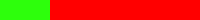

# Steps 11 - 15

## Step 11: Add Player Shields \(Health Bar\)

Right now, our game is very unforgiving — if the spaceship collides with just one asteroid, the game is over.

Let's give the spaceship some "shields" that will be damaged every time the ship collides with an asteroid. Once all the shields are gone, then the ship will explode.

Many games have some kind of health bar for the player's character — when the health reaches zero, the player dies in the game. The shields that we're going to add to our game are just a health bar for the spaceship.

Phaser has built-in properties and methods to keep track of the health of a sprite. When a sprite's health reaches zero, Phaser will automatically `kill()` the sprite.

* `health` is the property that represents a sprite's health value. You can set it to any value \(but many game designers use `100` as the starting value for a sprite's health\).
* `maxHealth` is a property that sets a maximum value for the sprite's health. You can set this to any value \(but many game designers also use `100` for the maximum value\). If your game has ways for the sprite's health to increase \(e.g., by collecting health packs, resting, etc.\), this will prevent the health from exceeding this limit.
* `damage()` is a method to decrease a sprite's health value. Inside the parentheses, you include a value representing the amount of damage.
* `heal()` is a method to increase a sprite's health value. Inside the parentheses, you include a value representing the amount of healing.

### Add Player Health and Damage

Add this Phaser code in your `create()` function \(after the command that set the angle of the player\):

```javascript
player.health = 100;
player.maxHealth = 100;
```

This will set the starting value of the player's health to 100 \(and also set 100 as the maximum value\).

Instead of killing the `player` sprite when it collides with an asteroid, let's damage the player's health by 25. After 4 collisions, the player's health will be zero, and Phaser will automatically `kill()` the `player` sprite.

In your `collideAsteriod()` function, replace the command that kills the player with this command instead:

```javascript
player.damage(25);
```

**Refresh your HTML preview to verify that it takes 4 collisions with asteroids before the spaceship explodes.**

### Add Health Bar for Shields

Now we just need to add a health bar, so the player has some visual feedback to track the amount of "shields" remaining for their spaceship.

Typically, a health bar is a rectangle that decreases \(or increases\) in width \(or height\) to represent the amount of health remaining. An easy way to do this in Phaser is to scale an image of a rectangle in one direction \(either its width or its height\).

We're going to use images of a red rectangle and a green rectangle to create our health bar:


Notice that these two bars are the exact same size. We're going to position them on top of each other as layers, so the red bar is **behind** the green bar.

The width of the green bar will represent the amount of health \("shields"\) remaining. When the shields are at maximum, the green bar will completely cover and hide the red bar.

When the player's health is damaged, we will scale down the width of the green bar, which will also reveal some of the red bar behind it. This will make it easier for the player to quickly see how much or how little health is remaining.

Let's first add a text label for the health bar \(so it will be clear to the player what this bar represents\):

* Add a global variable for `healthText`
* In your `create()` function \(after the code that added `scoreText`\), add `healthText` as a text object at position `210, 20`. Set the text to display: `'Shields'`. Use the same font styling that you used for `scoreText` \(Arial, 20px, bold, \#ffffff\)
* You do **not** need to set the text's anchor or add a text shadow.

**Refresh your HTML preview to verify that the text label \(Shields\) appears at the top of the game to the right of the score.**

We're going to add the red and green bars to the game as images instead of as sprites.

* Add a global variable for `healthBar`, which will represent the image of the green bar \(we **don't** need to create a variable for the red bar\)
* Preload **assets/images/health-red.png** as the image for the red bar. Assign it a unique asset key name, such as `red-bar`. \(Hint: If you need help, look back at Step 4 to see how to preload an image.\)
* Preload **assets/images/health-green.png** as the image for the green bar. Assign it a unique asset key name, such as `green-bar`.

Add this Phaser command in your `create()` function \(after the code that added `healthText`\):

```javascript
game.add.image(300, 20, 'red-bar');
```

This command does just what you think — it adds an image at position `300, 20` using the `red-bar` asset. Because we're **not** going to scale or change the red bar in any way, we **don't** have to assign it to a variable — we can just add it to the game.

**Refresh your HTML preview to verify that the red bar appears at the top of the game to the right of the "Shields" text.**

Now add this Phaser command \(immediately **after** the command that added the red bar\):

```javascript
healthBar = game.add.image(300, 20, 'green-bar');
```

This command adds the green bar at the exact same position and assigns it to the `healthBar` variable \(so that we can scale the green bar when the health value changes\).

Because you added the red bar first and then added the green bar, the green bar will be layered on top of the red bar.

**Refresh your HTML preview to verify that the green bar appears at the top of the game \(and hides the red bar, which is actually behind it\).**

### Scale the Health Bar

Now we just need to scale the width of the green bar, so it will shrink to represent the decrease in the player's health.

Phaser has a `scale` property for game objects \(such as: text, images, sprites, etc.\) that allows you to scale the object's width and height to make the object larger or smaller.

* To shrink the width or height, use a scale value that is between 0 and 1.
* To enlarge the width or height, use a scale value that is greater than 1.
* To keep the width or height the same size, use a scale value of exactly 1.

For our health bar, we only want to change the width of the green bar. We'll keep the height of the green bar the same size.

We can calculate the scale needed for the width of the `healthBar` by using a simple fraction — the scale should be the player's current health value divided by its maximum possible health value.

* For example, if the player's health is currently 25 and its maximum health value is 100, the scale for the width of the health bar should be 0.25 \(25/100\), which would look like this:

  

Add this Phaser command inside your `collideAsteroid()` function \(immediately **after** the command that damages the player\):

```javascript
healthBar.scale.setTo(player.health / player.maxHealth, 1);
```

This command sets the scale values for the width and height \(in order\) of the `healthbar` image. The scale for the width will be calculated by dividing the player's health by its maximum health. The scale for the height will be kept at 1, so the height of the image doesn't change.

**Refresh your HTML preview to verify that the width of the green health bar shrinks in proportion to the damage from each collision.**

In our case, each collision should shrink the width of the health bar by 25% of its original width until it reaches zero \(100 → 75 → 50 → 25 → 0\). When the shields reach zero, the spaceship will explode.

## Step 12: Add Player Lives

Some games only give the player one life during the game — when the player's character is killed, the game is over. Other games give the player unlimited lives, allowing the player to restart the game again and again \(often by sending the player back to a previous checkpoint in the game\). Some games give the player a limited number of lives.

The original _Asteroids_ game \(like many video games from the 1970s and '80s\) gave the player 3 lives at the start of the game. The player could also earn extra lives by reaching certain scores in the game.

We're going to add both of these features to our game. In this step, we'll give the player 3 lives \(spaceships\) at the start of the game. When the spaceship explodes, the player loses one life — but a new spaceship will appear as long as the player has at least one life left. When the player is out of lives, the game will be over.

Our game will also give the player a chance to earn an extra life as a bonus after every 10,000 score points \(10,000 → 20,000 → 30,000 → 40,000, etc.\). However, our game will also limit the total number of lives \(spaceships\) to a maximum of 5 lives.

### Add Lives Bar

Our game could just list the number of lives as text on the screen. Instead, we'll show spaceship icons to represent the number of lives. Visually, this will make it easier for the player to see at a glance how many lives remain. It will sort of be like a health bar for the number of lives left.

Here's the image for the number of lives remaining. It shows 5 spaceship icons because that's the maximum number of lives we decided to allow the player to have:


If we were to scale this image, we could make it look larger or smaller — but it would still show 5 spaceships.

So instead of scaling this image, we are going to **hide** part of it when the number of lives is less than 5.

Phaser has a method called `crop()` that allows you to only show part of an image \(and hide the rest\). You can also change the "crop" later to show less \(or more\) of the original image. The "crop" can be changed or reversed whenever you need because it doesn't actually alter the original image.

Let's first add a text label for the spaceship icons \(so it will be absolutely clear to the player what these icons represent\):

* Add a global variable for `livesText`
* In your `create()` function \(after the code that added `healthBar`\), add `livesText` as a text object at position `590, 20`. Set the text to display: `'Ships'`. Use the same font styling that you used for `scoreText` and `healthText` \(Arial, 20px, bold, \#ffffff\)
* You do **not** need to set the text's anchor or add a text shadow.

**Refresh your HTML preview to verify that the text label \(Ships\) appears at the top of the game to the right of the Shields health bar.**

Now you're going to add the spaceship icons to the game as an image:

* Add a global variable for `livesBar`
* Preload **assets/images/ship-lives.png** as the image for the spaceship icons. Assign it a unique asset key name, such as `lives`.
* Add the image to the game at position `655, 20` and assign it to the `livesBar` variable.

**Refresh your HTML preview to verify that the 5 spaceship icons appear at the top of the game to the right of the "Ships" text.**

### Crop the Lives Bar

Next we're going to start the player with 3 lives and crop the `livesBar` to only show 3 spaceships.

In order to crop an image, you create a rectangle of a specified width and height to represent the crop that you want to apply to an image. Then you can `crop()` the image using this rectangle. Any part of the original image that is outside of the crop rectangle will be hidden.

The spaceship icons image is similar to a spritesheet containing frames. The image has 5 identical spaceship icons, which are each 25 pixels in width and 25 pixels in height \(including the transparent area around each icon\). The entire image is 125 pixels in width and 25 pixels in height.

So we can set the **width** of the crop rectangle based on how many lives the player has left. For example, if the player has 3 lives left, then the crop rectangle should be set to a width of 75 pixels \(3×25\).

We want the **height** of the crop rectangle to be the same as the height of the spaceship icons image \(which is 25 pixels in height\).

Add these variables to your code:

* Add a global variable named `shipLives` and assign it an initial value of `3`
* Add a global variable called `livesCrop` to represent the crop rectangle

Add this Phaser code to your `create()` function \(after the command that added `livesBar`\):

```javascript
    livesCrop = new Phaser.Rectangle(0, 0, shipLives * 25, 25);
    livesBar.crop(livesCrop);
```

Let's examine this code:

* The first line of code creates a rectangle that you'll use for the crop. `0, 0` represent the position of the top-left corner of the crop rectangle \(relative to the top-left corner of the image that it will crop\). The next two numbers represent the width and height \(in order\) of the rectangle: `shipLives * 25` is the width, and `25` is the height.
* The second line applies the crop for the `livesBar` image using the `livesCrop` rectangle.

**Refresh your HTML preview to verify that the only 3 spaceship icons appear at the top of the game.**

### Subtract Life When Player Killed

Now we need to actually change the number of `shipLives` every time the player's spaceship is destroyed. Then we will want to re-crop the `livesBar` using a new width \(based on how many lives remain\).

As a reminder, in your `create()` function, you added an event that will run a function whenever the `player` is killed. This is where your game resets the `explosion` sprite and plays its animation. Now you're going to add some more code inside this event function to change the number of lives remaining and adjust the crop for the `livesBar`.

Add Phaser commands in your `player.events.onKilled` function to do the following \(in order\):

* Decrease the value of `shipLives` by `1`
* Change the width of `livesCrop` by calculating its new value: `livesBar.width = shipLives * 25;`
* Apply the crop for `livesBar` using the `livesCrop` rectangle

**Refresh your HTML preview to verify that only 2 spaceship icons will be shown after the spaceship is destroyed.**

### Spawn New Spaceship If Lives Remain

Now we need to respawn the player's spaceship if the player still has lives yet. We can use an if-else statement to determine if the number of lives left is greater than zero \(otherwise the game is over\).

Add this Phaser code in your `player.events.onKilled` function \(after the code that updated the crop for `livesBar`\):

```javascript
        // respawn player if lives are left
        if (shipLives > 0) {
            player.x = game.world.centerX;
            player.y = game.world.centerY;
            player.angle = -90;
            player.body.velocity.set(0);
            player.body.acceleration.set(0);
            player.revive(player.maxHealth);
            player.alpha = 0; // start as transparent
            game.add.tween(player).to({alpha:1}, 2000, Phaser.Easing.Cubic.Out, true);

        }
        else {
            // game over

        }
```

If the player still has at least one life left, this code will:

* position the `player` sprite back at the center of the game with the spaceship pointing up \(-90° angle\)
* sets the `player` sprite's velocity and acceleration to zero
* brings the `player` sprite back to life with maximum health using the `revive()` method \(alternatively, we could have used the `reset()` method\)
* fades the `player` sprite into view using a `to` tween on the sprite's `alpha` property \(`2000` means the tween will take 2 seconds to complete\)

Otherwise, the player has zero lives left, which means the game is over. In Step 14, we'll add some code to run when the game's over.

**Refresh your HTML preview to verify that a new spaceship will appear after the spaceship is destroyed. After 3 spaceships have been destroyed, the game should be over.**

### Add Teleport Sound Effect

Let's add some audio feedback to make it clear to the player that a new spaceship has appeared.

Add a sound effect that will play one time whenever a new spaceship appears:

* Use `teleportSound` as the name of the global variable for the sound.
* Use **assets/sounds/teleport.mp3** for the sound file. Assign a unique asset key name to the sound, such as `teleport`.
* Add `teleportSound` to the game with a volume of `0.5`.
* Add a Phaser command to play `teleportSound` inside your `player.events.onKilled` function \(after the code for the tween that fades in the new spaceship\).

**Refresh your HTML preview to verify that the teleport sound plays whenever a new spaceship appears.**

## Step 13: Add Extra Life Reward

Let's reward the player with an extra life every 10,000 score points \(10,000 → 20,000 → 30,000 → 40,000, etc.\). However, we will set a limit of 5 lives that the player can have at any point.

If the player already has 5 lives, we'll reward the player by setting the shields \(health\) back to maximum.

Let's play a sound effect as feedback to the player when either reward is received. We'll also do a visual effect when a new life is awarded.

If the player already has 5 lives and maximum health, then no reward will be given, but the player will get another chance to earn a reward after another 10,000 points.

Add code to your game to do the following:

* Add a global variable named `maxLives` and assign it a value of `5`
* Add a global variable named `newLife` and assign it an initial value of `10000`
* Add a global variable named `lifeSound` for the sound effect
* Preload **assets/sounds/extra-life.wav** and assign it a unique asset key name, such as `life`
* Add `lifeSound` to the game with a volume of `0.5`

Now let's plan out the code that we'll need to check to see if the player has earned an extra life reward.

If the player's `score` is greater than or equal to `newLife`, then the player has earned a reward:

* Next we need to check if the number of `shipLives` is less than `maxLives`. If that's true, we'll give the player an extra life.
* Otherwise the player already has the maximum number of lives, so we'll check if the player's `health` is less than its `maxHealth`. If that's true, we'll set the health back to its maximum.
* In either case, we need to increase `newLife` by another `10000` points, so the player can earn another reward later.

Let's add the code for this check as a separate function in your game code.

Add a new custom function named `checkNewLife()` \(after your `shootAsteroid()` function\).

Add this code inside the curly braces `{ }` of your `checkNewLife()` function:

```javascript
    if (score >= newLife) {
        if (shipLives < maxLives) {
            // award extra life

        }
        // maxLives already reached
        else if (player.health < player.maxHealth) {
            // replenish health instead

        }
        // increase score needed for next new life
        newLife = newLife + 10000;
    }
```

As you can see, this code will perform the check that we planned out. However, there is some missing code that you'll need to add inside the if-else statements.

Add Phaser commands to award an extra life:

* Increase the value of `shipLives` by `1`
* Change the width of `livesCrop` by calculating its new value based on `shipLives`
* Set the crop for `livesBar` using the `livesCrop` rectangle
* Update the crop for `livesBar`
* Play `lifeSound`
* Make the game screen flash a bright green color by using this command: `game.camera.flash(0x00ff00, 500);`

Add Phaser commands to replenish the player's health \(if the maximum number of lives is already reached\):

* Change the value of `player.health` to be equal to `player.maxHealth`
* Scale the `healthBar`
* Play `lifeSound`

Most importantly, we need to call the `checkNewLife()` function, in order for it to actually run. We could call this function either inside the `shootAsteroid()` function \(**after** the code that increases the `score`\) **OR** inside the `update()` function \(after the `collide()` commands is a good spot\) — choose just one of those places to call the function with this command:

```javascript
    checkNewLife();
```

**Refresh your HTML preview to verify that an extra life is awarded when the score reaches 10000 points. Another extra life should be awarded at 20000 points. If possible, verify that the shields will be replenished to maximum if you already have 5 ships when you reach the next new life score.**

## Step 14: Add Game Start and Game Over

At this point, you have a working version of _Asteroids_ with lots of features. Now we're going to add a simple "start screen" and "game over screen" to finish it.

### Add Game Title

At the start of the game, let's show an image of our game's title \(_Asteroids 2084_\).

Add code to do the following:

* Add a global variable named `gameTitle` for the title image.
* Preload **assets/images/asteroids-2084-title.png** for the title image. Assign a unique asset key name to the image, such as `title`.
* At the end of your `create()` function \(after the code that added and cropped the `livesBar`\), add the title image 100 pixels above the game's center, and assign the image to the `gameTitle` variable.
* Set the title image's anchor to be its center.
* Set the scale for the title image to be `0.75` for both its width and height.

**Refresh your HTML preview to verify that the game title appears on the screen. Currently, it will remain on-screen during the game, but we'll fix that in a bit.**

### Add Start Instruction

Let's add a way for the player to start the game when he or she is ready. We'll wait to show the spaceship until the player has pressed the fire key \(spacebar\). Once the fire key is pressed, we'll remove the game title \(and a start instruction\) from the screen, show the spaceship, and let the gameplay begin.

Add code to do the following:

* Add a global variable named `startText` for the start instruction text.
* In your `create()` function \(after the code that added the `gameTitle`\), add `startText` as a text object positioned 200 pixels below the game's center. Set the text to display: `'Press Fire to Start Mission'`. For the font style, use Arial, 30px, bold, \#00ff00 \(which will make the text slightly larger and bright green\).
* Set the text's anchor to be its center.

**Refresh your HTML preview to verify that the start instruction text appears on the screen. \(Just like the game title, it currently remains on-screen during the game, but we'll change that soon.\)**

### Hide Spaceship Until Game Started by Player

Now let's hide the spaceship until the player actually presses the fire key to start the mission.

Add these Phaser commands \(inside your `create()` function after the code that added the player animation\):

```javascript
    // hide player until game starts
    player.exists = false;
```

This code hides the `player` sprite by removing it from the game. Later, your code will add the sprite back into the game by setting the `exists` property back to `true`.

**Refresh your HTML preview to verify that the spaceship no longer appears on the screen.**

You probably discovered that pressing the fire key \(spacebar\) doesn't do anything yet. We're about to change that.

You might have also discovered that pressing the up arrow key will cause the `engineSound` to get louder \(as if the spaceship were accelerating, except it doesn't exist yet\).

Modify your existing if statement for the `arrowKey.up`, so it will check whether the `arrowKey.up` is being pressed AND the player exists.

* Hint: Look at your if statement for the `fireKey` as an example of how to do this

**Refresh your HTML preview to verify that the engine sound will not get louder if you press the up arrow key when the spaceship is not visible.**

### Add Signal and Custom Function to Start Game

Now we want to add a signal that will "start" the game when the player presses the fire key. However, we only want this signal to run one time. Once the game is "started", we want the fire key to fire the spaceship's laser.

Add this Phaser command in your `create()` function \(after the code that added the `fireKey` as a keyboard input\):

```javascript
fireKey.onDown.addOnce(startGame, this);
```

This command will add a [one-time signal](https://photonstorm.github.io/phaser-ce/Phaser.Signal.html#addOnce) to the `fireKey`: when this key is pressed down, it will call a custom function named `startGame` \(which you will need to create\).

Add a new custom function named `startGame()` \(after your `checkNewLife()` function\).

Add this code inside the curly braces `{ }` of your `startGame()` function:

```javascript
    // fade out start text
    game.add.tween(startText).to({alpha: 0}, 250, Phaser.Easing.Cubic.Out, true);

    // fade out and zoom out game title (after slight delay)
    game.add.tween(gameTitle).to({alpha: 0}, 3000, Phaser.Easing.Cubic.Out, true, 250);
    game.add.tween(gameTitle.scale).to({x: 3, y: 3}, 3000, Phaser.Easing.Cubic.Out, true, 250);

    // fade in player
```

As you can see, this code adds several `to` tweens that change the `startText` and `gameTitle`. All these tweens use the `Phaser.Easing.Cubic.Out` pattern, and `true` means the tweens will start automatically \(once the `startGame()` function is called\).

* The `startText` will fade out \(to an alpha value of zero, which is transparent\) over 0.25 seconds \(`250` milliseconds\).
* The `gameTitle` will fade out over 3 seconds but only starts after a 0.25 second delay \(the `250` after `true` represents a delay value\).
* At the same time, the `gameTitle` will also zoom out over 3 seconds \(`3000`\) by changing the scale of the image to 3 in both directions. This will also only start after a 0.25 second delay.

Now you need to add some missing code in this function to fade in the `player` sprite:

* Play the `teleportSound` \(as audio feedback to the player\)
* Make the `player` sprite exist \(by changing its `exists` property to `true`\)
* Add a `to` tween to make the `player` sprite fade into view by changing its alpha value to `1` over 2 seconds. Use the `Phaser.Easing.Cubic.Out` pattern, and set the tween to start automatically \(with no delay\).

**Refresh your HTML preview to verify that pressing the fire key will "start" the game \(fading out the start instruction, fading and zooming out the game title, fading in the spaceship and playing the teleport sound\).**

### Show Game Over Text When Player is Out of Lives

Now let's add a simple "game over" screen once the player is out of lives. We'll display some text and allow the player to restart a new game \(by pressing the fire key\).

Add code to do the following:

* Add a global variable named `gameOverText`
* In your `create()` function \(after the code that added the `startText`\), add `gameOverText` as a text object positioned 100 pixels above the game's center. Set the text to display: `'Game Over'`. For the font style, use Arial, 48px, bold, \#ff0000 \(which will make the text red\).
* Set the text's anchor to be its center
* Make the text invisible \(i.e., transparent\) by setting its `visible` property to `false`

Now we need to display the `gameOverText` and the `startText` when the player has run out of lives.

Add Phaser code in your `player.events.onKilled` function \(inside the `else` curly braces for when the player has no lives left\) to do the following:

* Make `gameOverText` visible
* Set the scale for `gameOverText` to be `3` for both its width and height
* Add a `to` tween to make `gameOverText` fade into view by changing its alpha value to `1` over 1 second. Use the `Phaser.Easing.Cubic.Out` pattern, and set the tween to start automatically \(with no delay\).
* Add a `to` tween to make `gameOverText.scale` zoom in by changing its value to `1` \(for both directions\) over 1 second. Use the `Phaser.Easing.Cubic.Out` pattern, and set the tween to start automatically \(with no delay\).
* Add a `to` tween to make `startText` fade into view by changing its alpha value to `1` over 0.5 seconds. Use the `Phaser.Easing.Cubic.Out` pattern, and set the tween to start automatically after a 2 second delay.

**Refresh your HTML preview to verify that the game over text and start instruction text appear on the screen when the player has run out of lives \(game over text should fade and zoom in first, then start instruction should fade in\).**

### Add Signal and Custom Function to Restart Game

Finally, when the game is over, we want to add a signal that will "restart" the game when the player presses the fire key again. However, we only want this signal to run one time.

Add a Phaser command in your `player.events.onKilled` function \(when the game is over\) to create a one-time signal that will call a custom function named `restartGame` when the `firekey` is pressed.

Add a new custom function named `restartGame()` \(after your `startGame` function\).

The `restartGame()` function needs to reset some of the game variables \(such as: `score`, `shipLives`, etc.\) back to their original values, and then restart the game.

Add code inside the curly braces `{ }` of your `restartGame()` function to do the following:

* Change the value of `score` back to `0`
* Change the value of `shipLives` back to `3`
* Change the value of `newLife` back to `10000`
* Change the value of the asteroids' `maxSpeed` back to `100`
* Restart the game state with this command:

  ```javascript
  game.state.restart();
  ```

**Refresh your HTML preview to verify that a new game can be restarted after the current game is over.**

Congratulations, you've completed your second practice game! Hopefully, the new Phaser commands made sense — you'll get the chance to use them again in the next practice game.

If you have the time and interest, you can add an enemy spaceship in Step 15. Be forewarned that it will require a lot of additional code, and only a small amount will be provided to you. Luckily, most of the necessary code is similar to things you've already done \(so you'll be able to copy and modify portions of your existing game code\).

## Step 15: Add Enemy Ship \(Extra Credit\)

The original _Asteroids_ game had enemy spaceships that would periodically appear and shoot at the player, adding an extra challenge to the game — but rewarding the player with a large score point bonus if the player destroys the enemy.

In this step, you can add an enemy ship to your game. You'll add a timer event to make the enemy ship appear every 30 seconds and move across the screen in a random direction and speed. You'll also add a simple AI \(artificial intelligence\) to make the enemy aim and shoot at the player.

Adding this enemy ship will involve lots of sub-steps with lots of additional code \(but most of it is similar to things you already have in your code\). However, adding the enemy ship will be worth it because it really increases the excitement and challenge of the gameplay experience.

### Add Global Variables for Enemy

Add global variables for the following:

* `enemy` \(enemy spaceship sprite\)
* `enemyLaser` \(enemy weapon\)
* `enemyExplosion` \(animated explosion sprite for enemy\)
* `enemyFireSound` \(sound played when enemy weapon is fired\)
* `enemyAlarmSound` \(sound played when enemy is alive\)

### Preload Assets for Enemy

In your `preload()` function, load the following assets:

* Load **assets/images/enemy-ship.png** as a spritesheet, and assign it a unique asset key name, such as `enemy-ship`. Each animation frame in this spritesheet is 64 pixels in width and 64 pixels in height.
* Load **assets/images/enemy-laser.png** as an image, and assign it a unique asset key name, such as `enemy-bullet`
* Load **assets/sounds/enemy-fire.wav** as audio, and assign it a unique asset key name, such as `enemy-fire`
* Load **assets/images/alarm.mp3** as audio, and assign it a unique asset key name, such as `enemy-alarm`

The `enemyExplosion` will just use the same spritesheet as the player `explosion` does \(so your code does not need to load it a second time\).

### Add Enemy


In your `create()` function \(after the code that added the `player` sprite\), add code for the `enemy` sprite:

* Add the `enemy` sprite at position `0, 0` \(which is a temporary position\) using the `enemy-ship` asset
* Set the sprite's anchor to its center
* Enable Arcade Physics for the sprite
* Set the sprite's body collision area to be a circle with a radius of 30 pixels that is offset 2 pixels from the left edge of the frame and 2 pixels from the top edge
* Have the game automatically kill the sprite when it leaves the game world boundaries by adding this code:

  ```javascript
    enemy.outOfBoundsKill = true;
    enemy.checkWorldBounds = true;
  ```

* Add an animation to the sprite to play all 3 frames \(in order 0-2\) at 10 frames per second in a continuous loop
* Play the animation \(so it will already be playing anytime the `enemy` is on-screen\)
* Hide the sprite \(until it is spawned\) by setting its `exists` property to `false`

### Add Enemy Laser


In your `create()` function \(before the code that adds the `enemy` sprite\), add code for the `enemyLaser` weapon:

* Add the `enemyLaser` weapon to the game with 5 bullets using the `enemy-bullet` asset
* Set the bullets to be killed automatically if they leave the camera boundaries
* Set the bullet speed to `400` pixels per second
* Set the fire rate to `750` \(once every 0.75 seconds\)
* Set the bullet body collision area to be a rectangle 16 pixels in width and 16 pixels in height that is offset 4 pixels from the left edge and 4 pixels from the top edge

After the code that adds the `enemy` sprite, add a command to:

* Set the `enemyLaser` weapon to track the `enemy` sprite with no offset but don't track the sprite's rotation \(set to `false`\)

### Add Enemy Explosion


In your `create()` function \(after the code that adds the `explosion` sprite used for the player\), add code for the `enemyExplosion` sprite:

* Add the `enemyExplosion` sprite at position `0, 0` \(which is a temporary position\) using the `explosion` asset \(same one used for player's explosion\)
* Set the sprite's anchor to its center
* Add an animation to the sprite to play all 16 frames \(in order 0-15\) at 30 frames per second \(with no loop\)
* Hide the sprite \(until it is needed\) by setting its `visible` property to `false`

### Add Enemy Fire Sound

In your `create()` function, add code for `enemyFireSound`:

* Add `enemyFireSound` to the game with a volume of `0.5`
* After the code that adds the `enemyLaser`, add an `enemyLaser.onFire` function containing a command to play the sound.

### Add Function to Spawn Enemy

You're going to create a custom function to spawn \(generate\) an enemy spaceship. Later, you'll add a timer to call \(run\) this custom function every 30 seconds.

Every time a new `enemy` is spawned, we want it to appear at a random location along one of the edges of the screen. The `enemy` should then move across the screen at a random speed and in a random direction.

After your `restartGame()` function, add a new custom function called `spawnEnemy()`.

Add this Phaser code inside the curly braces `{ }` of the function:

```javascript
    if (player.exists == false) return; // don't spawn enemy if game over or not started

    // generate random location (1-4) for enemy spawn site
    // 1 = top, 2 = right, 3 = bottom, 4 = left
    var spawnSite = Math.floor(Math.random() * 4) + 1;

    // generate random starting position and velocity to move enemy across screen
    if (spawnSite == 1) {
        enemy.x = Math.random() * 400 + 200; // 200 to 600
        enemy.y = 0; // top edge
        enemy.body.velocity.x = Math.random() * 100 - 50; // -50 to 50
        enemy.body.velocity.y = Math.random() * 50 + 100; // 100 to 150
    } else if (spawnSite == 2) {
        enemy.x = game.world.width; // right edge
        enemy.y = Math.random() * 200 + 200; // 200 to 400
        enemy.body.velocity.x = Math.random() * 50 - 150; // -150 to -100
        enemy.body.velocity.y = Math.random() * 100 - 50; // -50 to 50
    } else if (spawnSite == 3) {
        enemy.x = Math.random() * 400 + 200; // 200 to 600
        enemy.y = game.world.height; // bottom edge
        enemy.body.velocity.x = Math.random() * 100 - 50; // -50 to 50
        enemy.body.velocity.y = Math.random() * 50 - 150; // -150 to -100
    } else {
        enemy.x = 0; // left edge
        enemy.y = Math.random() * 200 + 200; // 200 to 400
        enemy.body.velocity.x = Math.random() * 50 + 100; // 100 to 150
        enemy.body.velocity.y = Math.random() * 100 - 50; // -50 to 50
    }

    enemy.revive();
```

The first line of this code checks to see whether the `player` sprite exists. If the player hasn't started the game yet or the game is over, `player.exists` will be `false`. If that's the case, the function will simply `return` \(i.e., end\) without performing the other code in this function.

The rest of the code in this function generates a random number between 1-4 to decide whether the enemy will be spawned from the top, right, bottom, or left of the game screen. Then it generates a random starting position to place the `enemy` somewhere along the edge of the screen. It also generates a random velocity to move the `enemy` across the screen towards the opposite side \(in a straight line\). The ranges for the random values have been chosen to keep the `enemy` on-screen for several seconds.

The last command brings the `enemy` sprite back to life.

### Add Enemy Alarm Sound

* In your `create()` function, add `enemyAlarmSound` to the game with a volume of `0.1`, and set the sound to loop continuously.
* In your `spawnEnemy()` function, play the sound when the enemy is brought back to life.
* In your `create()` function \(after the code that adds the `enemy`\), add an `enemy.events.onKilled` function containing a command to stop the sound.

### Add Enemy AI to Rotate and Fire

We want to add a simple AI \(artificial intelligence\) to control the `enemy`. The `enemy` will automatically move across the screen based on the velocity it was given when it was spawned. However, as it moves, we want the `enemy` to rotate to face towards the `player`, so the `enemy` can fire its laser at the `player`.

Add this Phaser code in your `update()` function \(after the code that spawns new asteroids\):

```javascript
    if (enemy.exists) {
        enemy.rotation = game.physics.arcade.angleBetween(enemy, player); // rotate enemy towards player
        var fireError = Math.floor(Math.random() * 20) - 10; // random number between -10 and 10
        enemyLaser.fireAngle = enemy.angle + fireError; // add error so enemy not perfect shot
        enemyLaser.fire();
    }
```

When the `enemy` exists on-screen, this code will rotate the `enemy` sprite to face towards the `player` \(by calculating the angle between these two sprites\). Then it adds a small amount of error to the `enemyLaser.fireAngle`. \(Otherwise, the enemy is always a perfect shot, making it too difficult for the player to avoid being hit.\) Then the `enemyLaser` fires towards the direction of the `player`. The `enemyLaser.fireRate` \(which you set in the `create()` function\) will automatically determine how frequently the enemy actually fires its weapon.

### Add Timer to Spawn Enemy

In your `create()` function \(after the code that adds the `enemy`\), add this Phaser command:

```javascript
game.time.events.loop(Phaser.Timer.SECOND * 30, spawnEnemy, this);
```

This command adds a timer event that will run in a loop: Every 30 seconds, it will call \(run\) the custom function named `spawnEnemy`.

**Refresh your HTML preview to verify that the enemy will appear once every 30 seconds \(from a random edge location - top, right, bottom, or left\). As the enemy flies across the screen, it should rotate to face towards the player and fire its weapon. The alarm sound and enemy fire sound should play.**

However, at this point, the enemy and its laser bullets don't affect anything else in the game because you haven't added any collisions involving the enemy or its bullets.

### Add Collision for Player and Enemy

1. In your `update()` function, add a `collide()` command for `player` and `enemy` \(list in this order\) that will call a custom function named `collideEnemy`.
2. At the end of your code, add a new custom function called `collideEnemy()`.
3. Inside the parentheses `( )` after the function's name, list these parameters \(in order\): `player, enemy`
4. Inside the curly braces `{ }` of the function, add Phaser commands to do the following:
   * Kill the `enemy`
   * Reset `enemyExplosion` to the x and y position of the `enemy`
   * Play the `enemyExplosion` animation
   * Play `boomSound`
   * Shake the game camera
   * Damage the `player` by `25` health points
   * Scale the player's `healthBar`

**Refresh your HTML preview to verify that the player's spaceship is damaged and the enemy spaceship explodes when they collide.**

### Add Collision for Player's Bullets and Enemy

1. In your `update()` function, add a `collide()` command for `laser.bullets` and `enemy` \(list in this order\) that will call a custom function named `shootEnemy`.
2. At the end of your code, add a new custom function called `shootEnemy()`.
3. Inside the parentheses `()` after the function's name, list these parameters \(in order\): `bullet, enemy`
4. Inside the curly braces `{ }` of the function, add Phaser commands to do the following:
   * Kill the `bullet`
   * Kill the `enemy`
   * Reset `enemyExplosion` to the x and y position of the `enemy`
   * Play the `enemyExplosion` animation
   * Play `boomSound`
   * Add `2500` to the player's `score`
   * Update `scoreText` to display the new `score` value
   * Call the `checkNewLife()` function \(NOTE: This is not needed if a call to `checkNewLife()` is already listed in your `update()` function\)

**Refresh your HTML preview to verify that the player's laser can destroy the enemy spaceship, awarding the player 2500 score points.**

### Add Overlap for Player and Enemy's Bullets

1. In your `update()` function, add an `overlap()` command for `player` and `enemyLaser.bullets` \(list in this order\) that will call a custom function named `shootPlayer`. As a reminder, `overlap()` is similar to `collide()` except `overlap()` doesn't transfer momentum between the two objects. \(If we used a `collide()` function here, the enemy's bullets would slow down the player's spaceship or even push it backwards, which seems unnatural.\)
2. At the end of your code, add a new custom function called `shootPlayer()`.
3. Inside the parentheses `()` after the function's name, list these parameters \(in order\): `player, bullet`
4. Inside the curly braces `{ }` of the function, add Phaser commands to do the following:
   * Kill the `bullet`
   * Play `boomSound`
   * Shake the game camera
   * Damage the `player` by `25` health points
   * Scale the player's `healthBar`

**Refresh your HTML preview to verify that the enemy's laser can damage the player's spaceship.**

### Add Collision for Enemy's Bullets and Asteroids

1. In your `update()` function, add a `collide()` command for `enemyLaser.bullets` and `asteroidGroup` that will call a custom function named `removeAsteroid`.
2. At the end of your code, add a new custom function called `removeAsteroid()`.
3. Inside the parentheses `( )` after the function's name, list these parameters \(in order\): `bullet, asteroid`
4. Inside the curly braces `{ }` of the function, add Phaser commands to do the following:
   * Kill the `bullet`
   * Set the x and y positions of `asteroidParticles` to the x and y positions of the `asteroid`
   * Kill the `asteroid`
   * Play the `explode()` particle effect for `asteroidParticles`
   * Play `boomSound`

**Refresh your HTML preview to verify that the enemy's laser will destroy an asteroid if hit.**

You might have noticed that we did not add a collision between the `enemy` and the `asteroidGroup`. This was intentional, so that the `player` has to either destroy or avoid the `enemy` \(rather than letting an asteroid randomly hit and destroy the `enemy`\). However, if you want, you could add this last type of collision to make the game slightly more realistic. It's your choice.

Congratulations, you've completed everything in Step 15! You should be feeling much more confident about your ability to use Phaser to code a video game.

