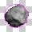
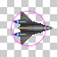
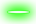

# Steps 6 - 10

## Step 6: Add Player Collision with Asteroids

Let's make the game respond if the spaceship collides with any of the asteroids.

Phaser's Arcade Physics system has two methods \(functions\) to detect when two game objects "touch" each other:

* `collide()` checks to see if the two objects are colliding and keeps them separated \(so they don't overlap\) — if one or both of the objects is moving, they can transfer momentum between each other \(if you set a `body.bounce` value for the objects, they'll bounce off each other\)
* `overlap()` simply checks to see if the two objects are overlapping \(but the objects will pass right through each other\)

The two objects being checked can be individual objects and/or groups of objects, such as: Sprite vs. Sprite, Sprite vs. Group, Group vs. Group. For groups, each member of the group is checked individually in sequence.

Add this Phaser command in your `update()` function \(before the if-else statements for the player movement\):

```javascript
game.physics.arcade.collide(player, asteroidGroup);
```

This command tells the Arcade Physics system to check for collisions between the `player` sprite and any sprite in the `asteroidGroup`.

**Refresh your HTML preview to verify that the spaceship can collide with the asteroids \(and it will change their velocity\).**

### Change Collision Areas of Sprites

You probably noticed that the spaceship and asteroids act like they collide before they touch. This is because the player sprite and each asteroid sprite are actually rectangles that have transparent areas. The transparent areas of the sprites are colliding, so it seems like they collide too soon.

Luckily, Arcade Physics has two ways that we can change the collision area of a sprite's `body` to more closely match its visual appearance:

* `body.setCircle()` allows you to change the sprite's collision area to be a circle of a specified radius \(which you can offset from the top-left corner of the sprite\)
* `body.setSize()` allows you to change the sprite's collision area to be a rectangle with a specified width and height \(which you can offset from the top-left corner of the sprite\)

Since the asteroids are basically circles, let's set their collision areas to be circles.

The asteroid sprite frames are 40 pixels in width and 40 pixels in height. If viewed in an image editor, you would see that the asteroid is about 30 pixels across in diameter with about 5 pixels of transparent area on all sides:



The pink circle drawn above represents the circular collision area that we want each asteroid to use \(instead of the full image\).

Add this Phaser command inside the `for` loop that adds the asteroids to the asteroid group \(after the code that sets the anchor for each asteroid\):

```javascript
asteroid.body.setCircle(15, 5, 5);
```

The `setCircle(15, 5, 5)` sets the body collision area to be a circle with a radius of 15 pixels \(30 pixels in diameter\) that is offset from the left edge of the frame by 5 pixels in the x-direction and offset from the top edge by 5 pixels in the y-direction. This offset will center the circle within the frame.

Let's do something similar with the spaceship, which has frames that are 64 pixels in width and 64 pixels in height. Visually, the spaceship is not a rectangle, and it's not a circle — it's more like a triangle. However, triangle is **not** an option for the body collision shape. Let's just use a circle because it's close enough \(besides the ship rotates in a circular motion\):



The pink circle drawn above represents the circular collision area that we'll use for the spaceship. It's not a perfect match, but it's better than the using the full image for collisions.

Add a Phaser command to set the body collision area of the `player` sprite to be a circle with a radius of 20 pixels that is offset by 12 pixels from the left of the frame and 12 pixels from the top of the frame. Add the command in the `create()` function \(after the command that enables physics on the `player` sprite\).

**Refresh your HTML preview to verify that the spaceship and asteroids are now visually closer when they collide with each other.**

What should really happen in our game when the spaceship collides with an asteroid is that the spaceship should be damaged or destroyed and the asteroid should be destroyed.

Modify your existing `collide()` statement in the `update()` function, so it looks like this:

```javascript
game.physics.arcade.collide(player, asteroidGroup, collideAsteroid, null, this);
```

This command tells the game to run a custom function named `collideAsteroid` when the physics system detects a collision between the `player` sprite and any sprite in the `asteroidGroup`. \(`null, this` are two additional parameters that you'll always include\). The two specific sprites involved in the collision will be passed into the custom function as parameters \(variables\).

Now you have to actually create a custom function named `collideAsteroid`, and add code inside to do something when this type of collision occurs.

Add this code to the very end of your **code.js** file \(after the `update()` function\):

```javascript
function collideAsteroid(player, asteroid) {

}
```

This creates the custom function, though it has no code yet inside its curly braces `{ }`.

Notice that we included `player, asteroid` inside the parentheses after the function's name. These represent the **parameters** — variables that are passed into the custom function when it is called. The parameters represent the specific sprites involved in the collision, in the same order they are listed in the `game.physics.arcade.collide()` function.

The parameter names act as local variables inside the custom function, so the names of the parameters do not have to exactly match the sprite names in the `collide()` function. However, it will be much easier to understand what's happening in the custom function if the names are either identical or similar. Inside the custom function, whatever you do to the parameter variables will affect the sprites they represent.

Within the custom function `collideAsteroid()`, the parameter `player` represents the `player` sprite \(easy to understand because both use the same name\). The parameter `asteroid` represents the specific asteroid sprite from the `asteroidGroup` that collided with the `player` sprite. \(We could use `ship` as the parameter name to represent the `player` sprite and `rock` as the parameter name to represent the sprite from the `asteroidGroup` — and the custom function would work exactly the same. However, the code might seem less clear to us.\)

### Kill Asteroid

Alright, enough of that — let's destroy the asteroid involved in the collision.

Add this Phaser command inside the `collideAsteroid()` function by pasting it between the curly braces `{ }`:

```javascript
asteroid.kill();
```

The `kill()` command removes a sprite from the game. Phaser actually keeps the sprite object saved in memory, in case you decide to reuse the sprite later. Phaser has commands to `revive()` or `reset()` a "dead" sprite to add it back into the game.

**Refresh your HTML preview to verify that each asteroid will disappear if it collides with the spaceship.**

### Add Collision Sound Effect

Now let's add a sound effect that will play one time whenever a collision occurs:

* Use `boomSound` as the name of the global variable for the sound.
* Use **assets/sounds/boom.wav** for the sound file. Assign a unique asset key name to the sound, such as `boom`.
* Add `boomSound` to the game with a volume of `0.3`.
* Add a Phaser command inside the `collideAsteroid()` function to play `boomSound`.

**Refresh your HTML preview to verify that the explosion sound plays whenever an asteroid collides with the spaceship.**

### Kill Player and Add Camera Shake

Add a Phaser command inside the `collideAsteroid()` function to kill the `player` sprite.

Let's also add a visual effect as feedback to make the collision feel more realistic.

Add this Phaser command inside the `collideAsteroid()` function:

```javascript
game.camera.shake(0.02, 250);
```

This command will cause the game screen to "shake" briefly when a collision occurs:

* The first number `0.02` represents the intensity of the camera shaking as a percentage of the camera size \(0.02 = 2%\).
* The second number `250` represents the duration of the shaking in milliseconds \(1000 milliseconds = 1 second\).

**Refresh your HTML preview to verify that the game display "shakes" and the spaceship disappears when it collides with an asteroid.**

### Add Explosion When Player Killed

Let's add an explosion effect when the `player` sprite is killed. The explosion will be an animated sprite that we'll hide from view until needed.

Use `explosion` as the name of the global variable for the sprite.

Use **assets/images/explosion.png** for the spritesheet image. It contains 16 animation frames that are each 128 pixels in width and 128 pixels in height. Assign a unique asset key name to the spritesheet, such as `explosion`.


In your `create()` function \(after the `for` loop that added the asteroids\), add the `explosion` sprite to position `100, 100` of the game \(this will just be a temporary position\), and set the sprite's anchor to its center.

Add an animation to the `explosion` sprite named `explode` that will play all 16 frames in order \(list an array from 0-15\) at a frame rate of 30, with loop set to `false`.

**Refresh your HTML preview to verify that the first frame of the explosion sprite is visible in the upper left of the game screen.**

We're actually going to hide the `explosion` sprite until we need to display it \(and then we'll move it to the `player` sprite's position when it's killed\).

Add this Phaser command to your `create()` function \(right after the command that added the animation for the `explosion` sprite\):

```javascript
explosion.visible = false; // hide until needed
```

**Refresh your HTML preview to verify that the explosion sprite is no longer visible.**

When the `player` sprite is killed, we will move the `explosion` sprite to the same position where the `player` was located, make the `explosion` sprite visible, play the `explode` animation, and then remove the `explosion` sprite again.

Add this Phaser code in your `create()` function \(after the code that added the `player` animation, but before the code that added the `asteriodGroup`\):

```javascript
    player.events.onKilled.add(function() {
        explosion.reset(player.x, player.y);
        explosion.animations.play('explode', 30, false, true);
    });
```

This code adds an event when the `player` sprite is killed. This event will perform the code listed inside the function's curly braces `{ }`:

* `reset()` makes the `explosion` sprite visible again and moves it to the x-y coordinates listed inside the parentheses. In this case, we want to make it appear at the `player` sprite's position.
* The command to play the animation includes an extra argument at the end:
  * `explode` is the animation key name
  * `30` is the frame rate
  * `false` means do not loop the animation \(play it only once\)
  * `true` means kill \(remove\) the sprite after the animation has ended

**Refresh your HTML preview to verify that the explosion animation will appear \(and then disappear after playing\) when and where the spaceship collides with an asteroid.**

## Step 7: Add Player Weapon

Let's give your `player` a way to fight back. It's time to add a weapon.

Phaser's Arcade Physics system includes a [Weapon](https://photonstorm.github.io/phaser-ce/Phaser.Weapon.html) object with properties and methods related to firing bullets. The weapon is really just a group of bullet objects.

The "bullets" for a weapon can be any image \(or spritesheet\) that you want: bullets, lasers, arrows, fireballs, etc. If you want the weapon to fire smiley face emojis, you can do that.

Adding a weapon to the game involves 3 steps:

* Declare a global variable for the weapon.
* Load an image \(or spritesheet\) for the bullets into memory in the `preload()` function.
* Add the weapon to the game in the `create()` function.

The weapon can then be fired in the `update()` function.

Let's get ready to add your weapon:

* Add a global variable named `laser` for the weapon.
* Preload **assets/images/laser.png** for the bullet image. Assign a unique asset key name to the image, such as `bullet`.

  

Remember that the order in which visual objects are added in the `create()` function determines which objects appear in front of \(or behind\) other objects. We want the weapon's bullets to look like they are being fired from beneath the spaceship, so we need to add the weapon before the `player` sprite is added in the code.

Add this Phaser code in your `create()` function \(before the code that adds the `player` sprite\):

```javascript
    laser = game.add.weapon(10, 'bullet');
    laser.bulletKillType = Phaser.Weapon.KILL_CAMERA_BOUNDS;
    laser.bulletSpeed = 600;
    laser.fireRate = 250;

    // set bullet collision area to match its visual size
    laser.setBulletBodyOffset(24, 12, 6, 6);
```

Let's examine this code:

* The first line adds the weapon. `10` represents the number of bullets to create in the bullet group.  The bullets will be recycled as they are fired, so this sets an upper limit on the maximum number that could be on-screen at any one time. `'bullet'` is the asset key name that it will use for each bullet.
* The second line will kill \(remove\) a bullet if it leaves the game display boundaries.  Phaser has multiple [options for bulletKillType](https://photonstorm.github.io/phaser-ce/Phaser.Weapon.html#bulletKillType).
* The third line sets the bullet speed in pixels per second.
* The fourth line sets a limit on the firing rate. In this case, a bullet can only be fired every 250 milliseconds \(even if the player holds down the fire key\).
* The last line changes the bullet's collision area to be a rectangle with a width of 24 pixels and height of 12 pixels offset 6 pixels from the left edge of the bullet image and offset 6 pixels from the top edge of the bullet image.

There are many other [Phaser.Weapon properties](https://photonstorm.github.io/phaser-ce/Phaser.Weapon.html) that you could use in other games, if needed.

We want the `laser` weapon to be associated with the `player` sprite. Phaser has a method for the weapon to track \(follow\) another sprite, so the bullets will be fired from that sprite's position.

Add this Phaser command in your `create()` function \(after the code that added the player `onKilled` event\):

```javascript
laser.trackSprite(player, 0, 0, true);
```

This command will ensure the `laser` weapon tracks the position of the spaceship:

* `player` represents the name of the sprite that the weapon will track
* `0, 0` represents an x-y offset from the sprite's anchor position. Using `0, 0` means the weapon will fire from the `player` sprite's center.
* `true` means that the weapon should also track the sprite's rotation. We need this for our game since the ship rotates, but other games may not need this \(so they could list `false` or nothing at all\).

### Fire Weapon When Fire Key Pressed

Now we just need a way to fire the `laser` weapon. Remember that way back in Step 2, you assigned the spacebar as an input named `fireKey`.

Add an `if` statement in your `update()` function \(after the if-else statements for the player movement\) to check when the `fireKey` is being pressed.

Add this Phaser command to your code, so it will be performed when your new `if` statement is true:

```javascript
laser.fire();
```

**Refresh your HTML preview to verify that your spaceship fires the laser weapon when the spacebar is pressed.**

You'll see that the laser "bullets" don't do anything yet — we'll have to add a collision between the laser bullets and the asteroids.

You'll also discover that the laser can still be fired even after the `player` sprite has been killed.

Modify your existing `if` statement for the `fireKey`, so it will check whether the `fireKey` is being pressed AND the player exists.

* Remember that `&&` is used to represent AND
* Command to check if player exists \(returns true or false\): `player.exists`

**Refresh your HTML preview to verify that the laser weapon can only be fired when the spaceship exists.**

### Add Weapon Sound Effect

Let's add a sound effect that will play whenever the weapon is fired:

* Use `fireSound` as the name of the global variable for the sound.
* Preload **assets/sounds/fire.wav** for the sound file. Assign a unique asset key name to the sound.
* Add `fireSound` to the game with a volume of `0.1`. Add the sound after the code that set the `laser` to track the `player` sprite.

Add this Phaser code inside your `create()` function \(after the code that added `fireSound`\):

```javascript
    laser.onFire.add(function() {
        fireSound.play();
    });
```

This code will play the `fireSound` every time the `laser` weapon is fired. The reason for playing the sound using this code is the weapon has a `fireRate` that limits how frequently it can fire. If we played the sound whenever the `fireKey` is being pressed, the sound would play too frequently \(and would play even when a new bullet is not actually fired\). So the code above will keep the sound effect synced with the actual weapon firing.

**Refresh your HTML preview to verify that the sound effect plays whenever the laser weapon is fired.**

### Add Collision Between Weapon Bullets and Asteroids

In your `update()` function \(directly after your existing `collide()` function\), add a new Arcade Physics `collide()` function to check for collisions between the laser bullets and the asteroids:

* Check for collisions between `laser.bullets` and `asteroidGroup`. List these two sprite groups in this order.
* When a collision is detected, it should run a custom function called `shootAsteroid`.

Add a new custom function named `shootAsteroid()` \(after your `collideAsteroid()` function\). Inside the parentheses `()` after the function name, list `bullet` and `asteroid` as parameters \(in that order\).

Inside the curly braces `{ }` of the `shootAsteroid()` function, add Phaser commands to:

* kill the asteroid
* kill the bullet
* play the boom sound effect

**Refresh your HTML preview to verify that the asteroids are destroyed when they are hit by the laser.**

## Step 8: Add Particle Effect to Asteroids

We have an explosion animation that plays when the `player` sprite is killed, so let's add a particle effect to show the asteroid breaking up into pieces when it's destroyed.

Phaser's Arcade Physics system includes a [Particle Emitter](https://photonstorm.github.io/phaser-ce/Phaser.Particles.Arcade.Emitter.html) object with properties and methods related to emitting particles. An emitter is just a group of particle objects \(similar to how a weapon is just a group of bullet objects\).

Particle emitters are useful for one-time events \(such as [explosions](http://phaser.io/examples/v2/particles/click-burst), etc.\) or continuous effects \(such as [rain](http://phaser.io/examples/v2/particles/rain), [snow](http://phaser.io/examples/v2/particles/snow), flames, etc.\).

Adding a particle emitter to the game involves 3 steps:

* Declare a global variable for the particle emitter.
* Load an image \(or spritesheet\) for the particles into memory in the `preload()` function.
* Add the particle emitter to the game in the `create()` function.

The particle emitter can then be activated in the `create()` function or `update()` function, depending on what you need for your game. The particle emitter can be a single point or can be an area of a specified width and height.

Let's get ready to add your particle emitter:

* Add a global variable named `asteroidParticles` for the particle emitter.
* Preload **assets/images/asteroid-particle.png** for the particle image. Assign a unique asset key name to the image, such as `particle`. This particle image is just a scaled down version \(20 pixels by 20 pixels\) of the first frame from the asteroid spritesheet:

Add this Phaser code in your `create()` function \(after the `for` loop that added the asteroids, but before the code that adds the `explosion` sprite\):

```javascript
    asteroidParticles = game.add.emitter(0, 0, 50);
    asteroidParticles.makeParticles('particle');
    asteroidParticles.gravity = 0;
    asteroidParticles.setAlpha(1, 0, 1000); // fade out after 1000 ms
```

Let's examine this code:

* The first line adds the particle emitter to the game. `0, 0` represent the x and y coordinates where the particles will be emitted from. \(Later, we'll change the x and y coordinates to match the x and y coordinates of the asteroid being killed.\) `50` represents the maximum number of particles to create in the emitter group.  We won't be using all 50 for a single particle explosion — we just want to have enough available in the game's memory, in case we need multiple particle explosions on-screen at the same time.
* The second line adds the particle objects to the emitter group using the provided asset key name.
* The third line sets the `gravity` property of the particles to zero \(since we don't want any gravity for our particular game\). By default, particles will have a gravity value of 100, unless you change it.
* The fourth line will make the particles fade out of view from an alpha of `1` \(opaque\) to `0` \(transparent\) over `1000` milliseconds \(1 second\).

When an asteroid collides with the spaceship or with a laser bullet, we want to create an "explosion" of particles at the asteroid's position.

Add this Phaser code in your `collideAsteroid()` function \(right before the `asteroid.kill()` command\):

```javascript
    asteroidParticles.x = asteroid.x;
    asteroidParticles.y = asteroid.y;
    asteroidParticles.explode(1000, 5);
```

Add the same code in your `shootAsteroid()` function \(right before the `asteroid.kill()` command\).

Let's examine this code:

* The first two lines set the x and y position of the `asteroidParticles` emitter to be the same as the x and y position of the asteroid involved in the collision.
* The third line creates an explosion effect from the particle emitter. `1000` represents the lifespan of the particles in milliseconds \(1000 ms = 1 second\), and `5` represents the number of particles to emit.

The particles will be emitted in random directions with slightly different speeds, so the `explode()` effect looks slightly different each time.

Remember in the `create()` function that we set our particles to fade out over 1000 milliseconds. Since we also set our particles to have a lifespan of 1000 milliseconds during the `explode()` effect, they will be removed as soon as they fade out.

If we didn't fade out the particles, they would disappear abruptly after 1000 milliseconds, which would look odd. The fading makes the particle explosion seem more natural.

**Refresh your HTML preview to verify that a particle explosion occurs when the asteroids are destroyed.**

## Step 9: Add Asteroid Spawning

Our game is not going to last very long if there are only 10 asteroids to shoot. As asteroids are destroyed, the game should periodically spawn \(generate\) new asteroids to replace them, so the game can keep going.

As part of our game's design, we'll keep it so there are never more than 10 asteroids at any one time. \(Of course, we didn't have to design our game that way.\)

Here are a few different options for when to spawn new asteroids:

* Immediately spawn a new asteroid whenever an existing asteroid is destroyed
* Use a timer to spawn a new asteroid after an existing asteroid is destroyed \(such as: making new asteroid appear 5 seconds after one is destroyed\)
* Use a random number to decide when to spawn a new asteroid after an existing asteroid has been destroyed \(i.e., timing of new asteroid will be random\)

Let's go ahead and use a random number for our asteroid spawning. It will add some variation and unpredictability to the asteroid spawning.

Add this Phaser code inside your `update()` function \(after the code that makes the asteroids wrap around the game world\):

```javascript
    // randomly add new asteroid if dead asteroid available
    if (Math.random() < 0.02) {
        var asteroid = asteroidGroup.getFirstDead();
        if (asteroid) {
            // reset asteroid at random position in game


            // give asteroid random speed and direction


            // make asteroid fade into view
            asteroid.alpha = 0; // start as transparent
            game.add.tween(asteroid).to({alpha: 1}, 500, Phaser.Easing.Cubic.Out, true);
        }
    }
```

There is some missing code that you will need to insert, but let's first explain how the provided code works:

* Each time a loop of the `update()` function occurs, the game will generate a random number \(which will be a decimal value between 0 and 1\). If the the random number is less than `0.02`, then it will check for a dead asteroid.  This means that each loop of the `update()` function has a 2% chance of checking for a dead asteroid. Even though 2% is a very low chance, the game loop runs many times per second, so it doesn't take that much time for a dead asteroid check to occur — however, the amount of time between each dead asteroid check will be random, which is what we wanted.
* When the random number is less than `0.02`, the code will check for the first dead \(killed\) sprite in the `asteroidGroup` and assign that dead sprite to a local variable called `asteroid`.  If there **aren't** any dead sprites at the moment, then `asteroid` will be assigned a value of `false`.
* The next check is whether `asteroid` is `true` — meaning was there a dead sprite? If so, then it performs the rest of the code \(which will reset the `asteroid` sprite, so it is "alive" again\).

Notice the `tween` command at the end. A [tween](https://photonstorm.github.io/phaser-ce/Phaser.Tween.html) is a command that allows you to change one or more properties of an object over a specified period of time. Tweens are very useful for adding different types of automated effects in your game. In this case, the tween will make the new asteroid fade into view by changing it from transparent to opaque over 0.5 seconds:

* The tween is added to the `asteroid` sprite, and it is a `to` tween.
* Inside the curly braces `{ }`, it lists all the properties of the sprite that will be tweened. In this example, we're just going to change the `alpha` property \(which represents the sprite's transparency\) from its current value \(which we set to `0` in the previous line of code\) to a new value of `1` \(which is opaque\).
* `500` represents the time period \(in milliseconds\) for the tween. So it will take 0.5 seconds for the `alpha` property to change from its current value to its new value.
* The change in the property will follow a pattern called `Phaser.Easing.Cubic.Out` \(which basically means it will change faster at first but then slow down — making this particular tween seem more "natural"\). Phaser has different types of [easing patterns](http://lets-gamedev.de/phasereasings/) that can be used for tweens.
* `true` tells Phaser to start the tween automatically. \(Otherwise, you can use `false` to set up a tween without running it, and then use a `start()` command to run the tween.\)

Now it's time for you to add the **missing** code inside the curly braces of the `if (asteroid)` statement:

* Add a Phaser command to `reset()` the `asteroid` at a random X-position and random Y-position in the game world. \(Hint: Look back at Step 6 to see how you reset the explosion sprite, and look at Step 5 to see how you can pick a random X and Y position in the game world\)
* Add Phaser code to give the asteroid a random speed and direction. \(Hint: How did you do this in Step 5?\)

Because we are "recycling" a dead asteroid sprite from the `asteroidGroup`, the "new" asteroid will still have the same properties as the original sprite — unless we change those properties.

So we did give the asteroid a **new** random starting position and a **new** random speed and direction.

However, notice that we did **not** have to add or change several other **existing** properties for the asteroid:

* We **didn't** need to set the anchor position for the asteroid. It will still use its same anchor position that was set when it was first added to the `asteroidGroup` in the `create()` function.
* We also **didn't** need to change the asteroid collision area to be a circle \(because it was already set to a circle when it was first created\).
* We also **didn't** have to add animations to the asteroid because it still has them from before. The sprite will also continue to play the same animation \(`spin-clock` or `spin-counter`\) that it was already playing before.

**Refresh your HTML preview to verify that "new" asteroids will randomly spawn and fade in after other asteroids are destroyed.**

Now your game will keep recycling the same 10 sprites in the `asteroidGroup`, so the gameplay can continue for as long as the player can stay alive.

### Increase Maximum Speed of Asteroids

Now that our game will keep spawning new asteroids as the player shoots them, let's have the game become more challenging as the player progresses.

Every time the player shoots an asteroid, let's increase the asteroid `maxSpeed` by a small amount. This won't change the speed of any existing asteroids. However, it will affect the possible speed of new asteroids.

A higher `maxSpeed` means each new asteroid has the potential to be slightly faster than the previous asteroids. Since the speed of each new asteroid is calculated as a random value \(up to the `maxSpeed`\), some of the new asteroids will still be slow — but over time \(as the player keeps shooting asteroids\), some of the new asteroids will be much faster — increasing the challenge of the game in response to the player's skill. \(Our game's attempt at promoting [flow]().\)

In your `shootAsteroid()` function, add a line of code to increase the value of `maxSpeed` by `1`:

```javascript
maxSpeed = maxSpeed + 1;
```

**Refresh your HTML preview to verify that some of the new asteroids seem to be faster as the game progresses.**

The change in the maximum possible speed is small, so it would require destroying at least 50 or more asteroids for it to start to become obvious that some of the new asteroids are faster — but don't worry, the asteroids will definitely get faster as the game progresses.

If you want to really speed things up, you could temporarily change the line of code to increase the `maxSpeed` by 10 — and then test it out to verify that it does affect the speed of new asteroids.

## Step 10: Add Score

Let's give the player some score points for every asteroid destroyed by a laser.

So we'll need a variable to keep track off the player's score, and we'll need to display the score as text in the game display.

As a reminder, adding text to the game involves 2 steps:

* Declare a global variable for the text.
* Add the text to the game in the `create()` function.

Once the text has been added, you can use the variable's `text` property to change what the text displays. This is typically done in your `update()` function or in a custom function.

Here's what you need to do:

* Declare a global variable called `score` and assign it an initial value of `0`
* Declare a global variable called `scoreText`
* In your `create()` function \(after the code that adds the keyboard inputs\), add `scoreText` as a text object at position `20, 20`. Set the text to display: `'Score: ' + score` \(which will display the text in the quotes followed by the current value of the `score` variable\). Use the same font styling that you used in Practice 1 \(Arial, 20px, bold, \#ffffff\)
* You do **not** need to set the text's anchor or add a text shadow.

If you need hints, look back at Step 7 of Practice 1.

**Refresh your HTML preview to verify that the score \(with a value of zero\) appears in the upper left of the game.**

Now we need to increase the score every time the player shoots an asteroid.

Add Phaser commands in your `shootAsteroid` function to do the following \(in order\):

* Increase the value of `score` by `250`
* Change the `text` property of `scoreText` by assigning it a value of: `'Score: ' + score`

If you need hints, look back at Step 9 of Practice 1.

**Refresh your HTML preview to verify that the score increases by 250 every time you shoot an asteroid.**

## Steps 11-15 continue on next page

